# Установка сервера 1C Предприятие на GNU/Linux

Отделу технического сопровождения в компании "РиК" была поставлена задача импортозамещения программного обеспечения. Одним из шагов в этом направлении было рассмотреть перенос платформы серверов 1С Предприятия на GNU/Linux. Необходимо проверить возможность установить и проверить функционал Платформы 1С:Предприятие исключительно на СПО.

 По окончанию данной лабораторной работы вы сможете:

- Установить и настроить сервер 1C предприятия на CentOS 7.
- Создавать кластер серверов 1С предприятия.
- Устанавливать и настраивать клиентские программы .

Оглавление

<!-- TOC -->

- [Установка сервера 1C Предприятие на GNU/Linux](#установка-сервера-1c-предприятие-на-gnulinux)
    - [Упражнение 1: Подготовка разрешения имён в сети и размещение дистрибутивов на серверах для последующей установки](#упражнение-1-подготовка-разрешения-имён-в-сети-и-размещение-дистрибутивов-на-серверах-для-последующей-установки)
        - [Задача 1: Загрузить файлы дистрибутива с оффициального сайта и перенести в виртуальные машины для установки](#задача-1-загрузить-файлы-дистрибутива-с-оффициального-сайта-и-перенести-в-виртуальные-машины-для-установки)
        - [Задача 2: Настроить разрешение имен в тестовой среде](#задача-2-настроить-разрешение-имен-в-тестовой-среде)
    - [Упражнение 2: Установка пакетов сервера и клиента Платформы 1С:Предприятие](#упражнение-2-установка-пакетов-сервера-и-клиента-платформы-1спредприятие)
        - [Задача 1: Установка клиента Платформы 1С:Предприятие на Windows 10 и проверка её работы с демонстрационной базой](#задача-1-установка-клиента-платформы-1спредприятие-на-windows-10-и-проверка-её-работы-с-демонстрационной-базой)
        - [Задача 2. Установка клиента Платформы 1С:Предприятие на Linux и проверка её работы с демонстрационной базой](#задача-2-установка-клиента-платформы-1спредприятие-на-linux-и-проверка-её-работы-с-демонстрационной-базой)
        - [Задача 3: Установка и настройка СУБД для сервера Платформы 1С:Предприятие на Linux](#задача-3-установка-и-настройка-субд-для-сервера-платформы-1спредприятие-на-linux)
        - [Задача 4: Установка компонентов сервера Платформы 1С:Предприятие на Linux](#задача-4-установка-компонентов-сервера-платформы-1спредприятие-на-linux)
    - [Упражнение 3: Создание кластера и СУБД и проверка работоспособности](#упражнение-3-создание-кластера-и-субд-и-проверка-работоспособности)

<!-- /TOC -->

 Описание тестовой среды
  
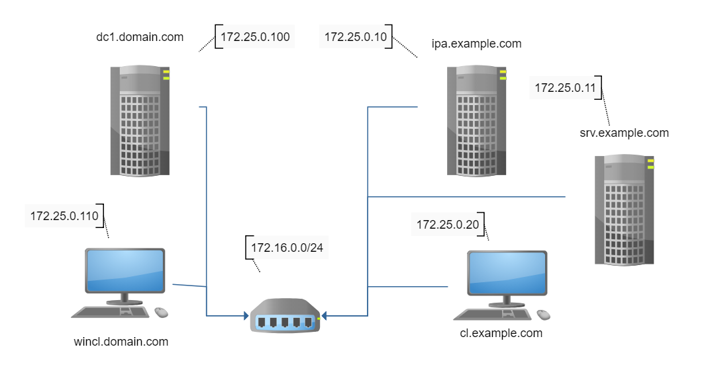

 Предположительное время: 2ч 30 минут

Виртуальные машины: ipa.example.com srv.example.com cl.example.com wincl.domain.com
Пояснение: dc.domain.com - используется нами только как инфраструктурный сервер (контроллер домена и dns) для машины wincl.
Платформа 1С:Предприятие 8.3 не требует Windows серверов и тем более не требует Active Directory домен

| Логин   | Пароль  |
| ---     | ---     |
| root    | redhat  |
| vagrant | vagrant |

## Упражнение 1: Подготовка разрешения имён в сети и размещение дистрибутивов на серверах для последующей установки

Перед установкой и настройкой непосредственно компонентов платформы нужно будет

1. Загрузить файлы дистрибутива с оффициального сайта и перенести в виртуальные машины для установки
2. Настроить разрешение имен в тестовой среде

Лабораторная работа предполагет наличие у вас регистрации на оффициальном сайте поставщика программного продукта, а также ранее прикреплённые к вашей учетной записи зарегистрированные программные продукты и из лицензии, используемые в настоящей работе. Практики также предполагают у вас начилие USB-ключа защиты.
Зайдите на оффициальную страницу поставщика дистрибутива `https://releases.1c.ru/project/Platform83` из раздела "Технологическая платформа 8.3" и загрузите файлы дистрибутива.

Нам нужны:

1. `8.3.*.*_windows64full.rar` - Платформа 1С:Предприятие 64x для Windows
2. `8.3.*.*_rpm32-64.zip` - rpm-пакеты сервера 1C:Предприятие для GNU/Linux
3. `8.3.*.*_clientz.rpm64.zip` - rpm-пакеты `тонкого` и `толстого` клиентов Платформа 1C:Предприятие для GNU/Linux
4. `1cv8.dt` - Файл выгрузки (архива) демонстрационной конфигурации. (Необязателен при наличии своей демонстрационной выгрузки СУБД для экспериментов.)

### Задача 1: Загрузить файлы дистрибутива с оффициального сайта и перенести в виртуальные машины для установки

Распакуйте архивы с созданием папок по названию архивов и разместите их в каталоге, где находится `Vagrantfile` демонстрационной среды с подкаталоге c названием `packages`. (Каталог )
Вот как в итоге должна выглядеть структура.
Запустите эмулятор терминала `cmd` или `cmder` и сделайте каталог ipa-lab\vagrant текущим
Дайте команду `dir`, вы должны увидеть список содержимого каталога `vagrant`.

```cmd
c:\VMs\ipa-lab\vagrant
λ dir
...
03.10.2018  21:34    <DIR>          .
03.10.2018  21:34    <DIR>          ..
28.09.2018  21:31                20 .gitignore
28.09.2018  18:24    <DIR>          .vagrant
03.10.2018  21:29    <DIR>          distrib
01.10.2018  09:12    <DIR>          scripts
03.10.2018  20:12            10 323 VagrantFile
...
```

Если виртуальные машины ещё не созданы, запустите создание их командой `vagrant up`.
Если виртуальные машины созданы ранее, то остановите и запустите Linux машины [`ipa`,`srv`,`cl`]`.example.com` с CentOS 7.

```
c:\VMs\ipa-lab\vagrant
λ vagrant halt "/ipa|srv||^cl/"
...
λ vagrant up "/ipa|srv||^cl/"
...
```

Проверим, что распакованные в соответствующие архивам папку файлы дистрибутива попали на диски виртуальных машин.

```
C:\VMs\ipa-lab\vagrant (master -> origin)
λ vagrant ssh ipa --command "ls -al /vagrant/distrib"
total 8
drwxrwxrwx. 1 vagrant vagrant    0 Oct  3 21:29 .
drwxrwxrwx. 1 vagrant vagrant 4096 Oct  3 21:34 ..
drwxrwxrwx. 1 vagrant vagrant    0 Oct  3 21:29 8.3.13.1513_clientz.rpm64
drwxrwxrwx. 1 vagrant vagrant    0 Oct  3 21:29 8.3.13.1513_rpm32-64
drwxrwxrwx. 1 vagrant vagrant 4096 Oct  3 21:29 8.3.13.1513_windows64full
Connection to 127.0.0.1 closed.

C:\VMs\ipa-lab\vagrant (master -> origin)
λ vagrant ssh cl --command "ls -al /vagrant/distrib"
total 8
drwxrwxrwx. 1 vagrant vagrant    0 Oct  3 21:29 .
drwxrwxrwx. 1 vagrant vagrant 4096 Oct  3 21:34 ..
drwxrwxrwx. 1 vagrant vagrant    0 Oct  3 21:29 8.3.13.1513_clientz.rpm64
drwxrwxrwx. 1 vagrant vagrant    0 Oct  3 21:29 8.3.13.1513_rpm32-64
drwxrwxrwx. 1 vagrant vagrant 4096 Oct  3 21:29 8.3.13.1513_windows64full
Connection to 127.0.0.1 closed.
```

Файлы пакетов дистрибутива попали внутрь жестких дисков виртуальных машин `srv.example.com`, `cl.example.com`.

В ОС Microsoft Windows изменения синхронизируемого каталога  `C:\Vagrant`  обнаруживуются моментально во время изменения его содержимого благодаря тому, что она монтирует каталог `c:\vagrant` с помощью SMB протокола. В специальных действиях для синхронизации `wincl.domain.com`на ОС `Microsoft Windows` в не нуждается. Откройте окно виртуальной машины `wincl.domain.com`. Там в обозревателе файлов откройте содержимое каталога `C:\vagrant\distrib\8.3.13.1513_windows64full`. Вы должны увидеть примерно следующее.

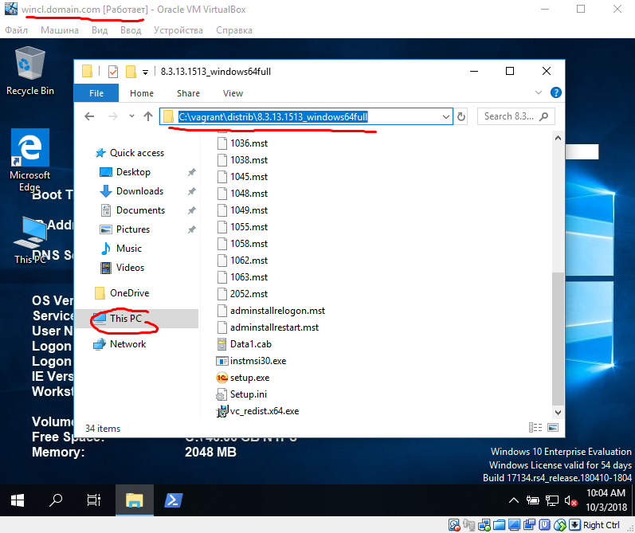

### Задача 2: Настроить разрешение имен в тестовой среде

Изначально тестовая среда создавалась для лабораторной работы "Интеграция GNU/Linux IPA с Microsoft Active Directory".
В начальном состоянии виртуальные машины не могут разрешать имена доменов example.com.
Повторим часть действий по настройке тестовой среды

1. Настроим IPA домен:Поставим и настроим разрешение имён для сети `*.example.com`
2. Настроим взаимный dns forwarding для возможности разрешать имена доменов `example.com` и `domain.com` на всех компьютерах

Зайдите на ipa, создайте и запустите скрипт, настраивающий IPA домен, DNS сервер и разрешение имен на `ipa.example.com` машине.

```
C:\VMs\ipa-lab\vagrant (master -> origin)
λ vagrant ssh ipa
[vagrant@ipa ~]$ sudo -s
[root@ipa vagrant]# su -

[root@ipa vagrant]# cat <<EOF >script.sh
#!/bin/bash

echo -e "Configuring IPA & DNS server: \n"
yum install -y bind bind-utils  bind-dyndb-ldap ipa-server ipa-server-dns

yum install -y rng-tools
rngd -r /dev/urandom

# yum update -y
 
 #nmcli conn modify System\ eth0 ipv4.ignore-auto-dns on
 #nmcli conn up System\ eth0

sed -i /.*ipa.*/d /etc/hosts
echo "172.25.0.10 ipa.example.com ipa" >> /etc/hosts


ipa-server-install \
    --domain=example.com \
    --realm=EXAMPLE.COM \
    --ds-password=password \
    --admin-password=password \
    --hostname=ipa.example.com \
    --ip-address=172.25.0.10 \
    --reverse-zone=0.25.172.in-addr.arpa. \
    --forwarder=8.8.8.8 \
    --allow-zone-overlap \
	--ssh-trust-dns \
	--allow-zone-overlap \
    --setup-dns \
    --unattended

nmcli connection modify 'System eth0' ipv4.ignore-auto-dns yes && nmcli connection up 'System eth0'
EOF

[root@ipa vagrant]# chmod +x script.sh
[root@ipa vagrant]# ./script.sh
Configuring IPA & DNS server:
...
# тут будет много сообщений о настройке IPA сервера и придётся подождать пару минут, не теряйте времени, вы можете пока переходить к следующему заданию, но не забудьте потом вернуться и настроить dns forward.
...
Configured /etc/openldap/ldap.conf
Configured /etc/ssh/ssh_config
Configured /etc/ssh/sshd_config
Configuring example.com as NIS domain.
Client configuration complete.
The ipa-client-install command was successful


Setup complete

Next steps:
        1. You must make sure these network ports are open:
                TCP Ports:
                  * 80, 443: HTTP/HTTPS
                  * 389, 636: LDAP/LDAPS
                  * 88, 464: kerberos
                  * 53: bind
                UDP Ports:
                  * 88, 464: kerberos
                  * 53: bind
                  * 123: ntp

        2. You can now obtain a kerberos ticket using the command: 'kinit admin'
           This ticket will allow you to use the IPA tools (e.g., ipa user-add)
           and the web user interface.

Be sure to back up the CA certificates stored in /root/cacert.p12
These files are required to create replicas. The password for these
files is the Directory Manager password
Connection successfully activated (D-Bus active path: /org/freedesktop/NetworkManager/ActiveConnection/3)
[vagrant@ipa ~]$ kinit admin
Password for admin@EXAMPLE.COM: <password>
[vagrant@ipa ~]$ ipa dnsforwardzone-add domain.com \
                                      --forward-policy=only \
                                      --forwarder=172.25.0.100 \
                                      --skip-overlap-check
Server will check DNS forwarder(s).
This may take some time, please wait ...
  Zone name: domain.com.
  Active zone: TRUE
  Zone forwarders: 172.25.0.100
  Forward policy: only
[vagrant@ipa ~]$ ipa dnsrecord-add example.com srv --a-rec 172.25.0.11
  Record name: srv
  A record: 172.25.0.11
[vagrant@ipa ~]$ ipa dnsrecord-add example.com cl --a-rec 172.25.0.20
  Record name: cl
  A record: 172.25.0.20
[vagrant@ipa ~]$              
```
Откроем необходимые порты для FreeIPA сервера в firewalld

```less
[root@ipa root]# firewall-cmd --add-service=http --permanent
[root@ipa root]# firewall-cmd --add-service=https --permanent
[root@ipa root]# firewall-cmd --add-service=freeipa-ldap --permanent
[root@ipa root]# firewall-cmd --add-service=freeipa-ldaps --permanent
[root@ipa root]# firewall-cmd --add-service=freeipa-replication --permanent
[root@ipa root]# firewall-cmd --add-service=freeipa-trust --permanent
[root@ipa root]# firewall-cmd --add-service=kerberos --permanent
[root@ipa root]# firewall-cmd --add-service=dns --permanent
[root@ipa root]# firewall-cmd --add-service=ntp --permanent
[root@ipa root]# firewall-cmd --reload
[root@ipa root]# chattr +i /etc/resolv.conf # Сделаем так, чтобы `vagrant` не смог изменить файл.
[root@ipa vagrant]# logout
[vagrant@ipa ~]$ dig +noall +answer SOA domain.com
domain.com.             3423    IN      SOA     dc.domain.com. hostmaster.domain.com. 53 900 600 86400 3600
[vagrant@ipa ~]$ dig +noall +answer SRV _ldap._tcp.domain.com
_ldap._tcp.domain.com.  600     IN      SRV     0 100 389 dc.domain.com.
[vagrant@ipa ~]$ dig +noall +answer A dc.domain.com
dc.domain.com.          3600    IN      A       172.25.0.100


[root@ipa vagrant]# logout
[vagrant@ipa ~]$ logout
```

Откройте терминал на `cl.example.com`и настройте локальный резолвер и проверьте разрешение имён dns доменов `example.com` и `domain.com`. 
Повторите эту же процедуру и для `srv.example.com`.

```
C:\VMs\ipa-lab\vagrant (master -> origin)
λ vagrant ssh cl
[vagrant@cl ~]$ sudo -s
[root@cl vagrant]# nmcli connection modify 'System eth1' ipv4.dns 172.25.0.10 && nmcli connection up 'System eth1'
Connection successfully activated (D-Bus active path: /org/freedesktop/NetworkManager/ActiveConnection/4)
[root@cl vagrant]# nmcli connection modify 'System eth0' ipv4.ignore-auto-dns yes && nmcli connection up 'System eth0'
Connection successfully activated (D-Bus active path: /org/freedesktop/NetworkManager/ActiveConnection/5)
[root@cl vagrant]# cat /etc/resolv.conf
# Generated by NetworkManager
search example.com
nameserver 172.25.0.10
options single-request-reopen
[root@ipa root]# chattr +i /etc/resolv.conf # Сделаем так, чтобы `vagrant` не смог изменить файл.
[root@cl ~]$ dig +noall +answer A dc.domain.com
dc.domain.com.          3600    IN      A       172.25.0.100
[root@cl ~]$ dig +noall +answer A ipa.example.com
ipa.example.com.        3600    IN      A       172.25.0.10
[root@cl vagrant]# logout
[vagrant@cl ~]$ logout
C:\VMs\ipa-lab\vagrant (master -> origin)
λ vagrant ssh srv
[vagrant@srv ~]$ sudo -s
[root@srv vagrant]# nmcli connection modify 'System eth0' ipv4.ignore-auto-dns yes && nmcli connection up 'System eth0'
Connection successfully activated (D-Bus active path: /org/freedesktop/NetworkManager/ActiveConnection/3)
[root@srv vagrant]# nmcli connection modify 'System eth1' ipv4.dns 172.25.0.10 && nmcli connection up 'System eth1'
Connection successfully activated (D-Bus active path: /org/freedesktop/NetworkManager/ActiveConnection/4)
[root@srv vagrant]# cat /etc/resolv.conf
# Generated by NetworkManager
search example.com
nameserver 172.25.0.10
options single-request-reopen
[root@srv root]# chattr +i /etc/resolv.conf # Сделаем так, чтобы `vagrant` не смог изменить файл.
[root@srv ~]$ dig +noall +answer A dc.domain.com
dc.domain.com.          3600    IN      A       172.25.0.100
[root@srv ~]$ dig +noall +answer A ipa.example.com
ipa.example.com.        3600    IN      A       172.25.0.10

[root@srv vagrant]#

```

Откройте окно виртуальной машины `dc.domain.com` и запустите cmd.exe из-под Администратора

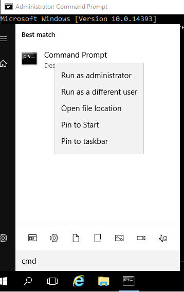

Добавьте настройку перенаправления DNS запросов домена `example.com` на ip-адрес `ipa.example.com`

```
Microsoft Windows [Version 10.0.14393]
(c) 2016 Microsoft Corporation. All rights reserved.

C:\Windows\system32>dnscmd /zoneadd example.com /dsforwarder 172.25.0.10 /TimeOut 30
DNS server . version is 10.0.14393

Creating zone in built-in domain directory partition...
DNS Server . created zone example.com:

Command completed successfully.

C:\Windows\system32>
```

Теперь проверим, что записи dns доменов `domain.com` `example.com` разрешаются на Windows 10 машине  `wincl.domain.com`

```
C:\VMs\ipa-lab\vagrant (master -> origin)
λ vagrant powershell wincl
==> wincl: Detecting if a remote PowerShell connection can be made with the guest...
    wincl: Creating powershell session to 127.0.0.1:2205
    wincl: Username: vagrant
[127.0.0.1]: PS C:\Users\vagrant\Documents> Resolve-DnsName ipa.example.com

Name                                           Type   TTL   Section    IPAddress
----                                           ----   ---   -------    ---------
ipa.example.com                                A      1012  Answer     172.25.0.10


[127.0.0.1]: PS C:\Users\vagrant\Documents> Resolve-DnsName dc.domain.com

Name                                           Type   TTL   Section    IPAddress
----                                           ----   ---   -------    ---------
dc.domain.com                                  A      3600  Answer     172.25.0.100


[127.0.0.1]: PS C:\Users\vagrant\Documents>
```

## Упражнение 2: Установка пакетов сервера и клиента Платформы 1С:Предприятие

Теперь настала пора поставить сначала по отдельности клиентскую и серверные компоненты платформы.

1. Установка клиента Платформы 1С:Предприятие на Windows 10 и проверка её работы с демонстрационной базой
2. Установка клиента Платформы 1С:Предприятие на Linux и проверка её работы с демонстрационной базой
3. Установка компонентов сервера Платформы 1С:Предприятие на Linux
4. Установка и настройка СУБД для сервера Платформы 1С:Предприятие на Linux

### Задача 1: Установка клиента Платформы 1С:Предприятие на Windows 10 и проверка её работы с демонстрационной базой

Установим Платформу 1С:Предприятие сначала на на машину `wincl.example.com` с Windows 10 в тестовую среду, чтобы познакомиться с данными, которые мы будем переносить.

> На машине `wincl.example.com` стоит `Английская США` версия ОС и языкового пакета. Через панель настроек загрузите и поставьте русский языковой интерфейс.
> После загрузки и установки выйдите и зайдите под пользователем `DOMAIN\vagrant` с паролем `vagrant`.

Откройте окно виртуальной машины `cl.example.com`. В обозревателе файлов найдите `C:\vagrant\distrib\8.3.13.1513_windows64full` дистрибутив Платформа 1С:Предприятие и запустите установку через запуск `setup.exe`. Выберите *все* компоненты для установки.
дайте команду на регистрацию апплета администрирования.

> В данной лабораторной работе не рассматривается вопрос лицензирования и решение вопроса лицензий ввиду требования у вас наличия аппаратного ключа.
> Для того чтобы аппаратный ключ попал в тестовую среду выключите машину. В свойствах оборудования добавьте "USB 3.0" контроллер, включите машину и пробросьте аппаратный ключ.

Запустите 1С:Предприятие и создайте новую базу. Запустите конфигуратор и подгрузите выгрузку демонстрационной конфигурации из файла `C:\vagrant\distrib\1cv8.dt`
Закройте конфигуратор и запустите 1С:Предприятие. Вы должны получить примерно такое окно программы.


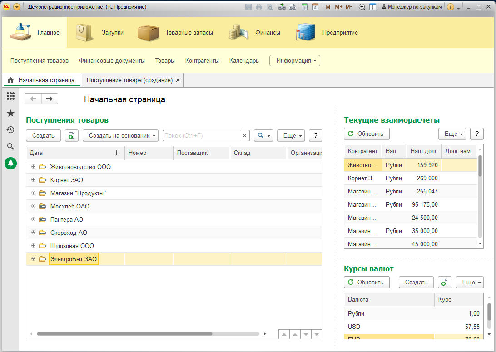


Так мы проверили, что клиентские приложения на Windows 10 работают с базой в локальном файловом режиме.

### Задача 2. Установка клиента Платформы 1С:Предприятие на Linux и проверка её работы с демонстрационной базой

Теперь проверим клиентские приложения и на Linux

Запустим терминал и поставим пакеты для клиентской части.

```
C:\VMs\ipa-lab\vagrant (master -> origin)
λ vagrant ssh cl
[vagrant@cl ~]$ sudo ls -al /vagrant/
total 21
drwxrwxrwx.  1 vagrant vagrant  4096 Oct  3 21:34 .
dr-xr-xr-x. 18 root    root      239 Oct  3 21:36 ..
drwxrwxrwx.  1 vagrant vagrant     0 Oct  4 00:57 distrib
-rwxrwxrwx.  1 vagrant vagrant    20 Sep 28 21:31 .gitignore
drwxrwxrwx.  1 vagrant vagrant  4096 Oct  3 23:28 scripts
drwxrwxrwx.  1 vagrant vagrant     0 Oct  3 22:40 .vagrant
-rwxrwxrwx.  1 vagrant vagrant 10359 Oct  3 22:36 VagrantFile
[vagrant@cl ~]$ sudo ls -al /vagrant/distrib/8.3.13.1513_clientz.rpm64/8.3.13.1513_client.rpm64/
total 307572
drwxrwxrwx. 1 vagrant vagrant      4096 Oct  3 21:29 .
drwxrwxrwx. 1 vagrant vagrant         0 Oct  3 21:29 ..
-rwxrwxrwx. 1 vagrant vagrant 155291374 Sep 16 09:10 1C_Enterprise83-client-8.3.13-1513.x86_64.rpm
-rwxrwxrwx. 1 vagrant vagrant  22308081 Sep 16 09:10 1C_Enterprise83-client-nls-8.3.13-1513.x86_64.rpm
-rwxrwxrwx. 1 vagrant vagrant 121126374 Sep 16 09:10 1C_Enterprise83-thin-client-8.3.13-1513.x86_64.rpm
-rwxrwxrwx. 1 vagrant vagrant  16219171 Sep 16 09:10 1C_Enterprise83-thin-client-nls-8.3.13-1513.x86_64.rpm
[vagrant@cl ~]$ sudo ls -al /vagrant/distrib/8.3.13.1513_clientz.rpm64/8.3.13.1513_thin.client.rpm64/
total 134128
drwxrwxrwx. 1 vagrant vagrant         0 Oct  3 21:29 .
drwxrwxrwx. 1 vagrant vagrant         0 Oct  3 21:29 ..
-rwxrwxrwx. 1 vagrant vagrant 121126374 Sep 16 09:10 1C_Enterprise83-thin-client-8.3.13-1513.x86_64.rpm
-rwxrwxrwx. 1 vagrant vagrant  16219171 Sep 16 09:10 1C_Enterprise83-thin-client-nls-8.3.13-1513.x86_64.rpm
[vagrant@cl ~]$  sudo cat /etc/resolv.conf
# Generated by NetworkManager
search example.com
nameserver 172.25.0.10
options single-request-reopen

[vagrant@cl ~]$ sudo yum install -y epel-release # Поставим поддержку репозитория EPEL
...
[vagrant@cl ~]$ sudo yum install -y firefox libreoffice    #Поставим комплект типовых офисных приложений
...

[vagrant@cl ~]$ mv /vagrant/distrib/8.3.13.1513_rpm32-64/8.3.13.1513_rpm64/1C_Enterprise83-*.rpm /vagrant/distrib/all
[vagrant@cl ~]$ mv /vagrant/distrib/8.3.13.1513_clientz.rpm64/8.3.13.1513_client.rpm64/1C_Enterprise83-client-*.rpm /vagr ant/distrib/all
[vagrant@cl ~]$ cd /vagrant/distrib/all
[vagrant@cl distrib]$ cd all/
[vagrant@cl all]$ ls -al
total 517188
drwxrwxrwx. 1 vagrant vagrant      4096 Oct  4 02:04 .
drwxrwxrwx. 1 vagrant vagrant      4096 Oct  4 02:06 ..
-rwxrwxrwx. 1 vagrant vagrant 155291374 Sep 16 09:10 1C_Enterprise83-client-8.3.13-1513.x86_64.rpm
-rwxrwxrwx. 1 vagrant vagrant  22308081 Sep 16 09:10 1C_Enterprise83-client-nls-8.3.13-1513.x86_64.rpm
-rwxrwxrwx. 1 vagrant vagrant  32932813 Sep 16 09:10 1C_Enterprise83-common-8.3.13-1513.x86_64.rpm
-rwxrwxrwx. 1 vagrant vagrant   6272534 Sep 16 09:10 1C_Enterprise83-common-nls-8.3.13-1513.x86_64.rpm
-rwxrwxrwx. 1 vagrant vagrant 237057486 Sep 16 09:10 1C_Enterprise83-server-8.3.13-1513.x86_64.rpm
-rwxrwxrwx. 1 vagrant vagrant  75461942 Sep 16 09:10 1C_Enterprise83-server-nls-8.3.13-1513.x86_64.rpm
-rwxrwxrwx. 1 vagrant vagrant    230780 Sep 16 09:10 1C_Enterprise83-ws-8.3.13-1513.x86_64.rpm
-rwxrwxrwx. 1 vagrant vagrant     18415 Sep 16 09:10 1C_Enterprise83-ws-nls-8.3.13-1513.x86_64.rpm
[vagrant@cl all]$

[vagrant@cl all]$ sudo yum localinstall 1C_Enterprise83-*.rpm
...
Installing:
 1C_Enterprise83-client          x86_64      8.3.13-1513        /1C_Enterprise83-client-8.3.13-1513.x86_64          399 M  
 1C_Enterprise83-client-nls      x86_64      8.3.13-1513        /1C_Enterprise83-client-nls-8.3.13-1513.x86_64      189 M  
 1C_Enterprise83-common          x86_64      8.3.13-1513        /1C_Enterprise83-common-8.3.13-1513.x86_64           79 M  
 1C_Enterprise83-common-nls      x86_64      8.3.13-1513        /1C_Enterprise83-common-nls-8.3.13-1513.x86_64       11 M  
 1C_Enterprise83-server          x86_64      8.3.13-1513        /1C_Enterprise83-server-8.3.13-1513.x86_64          459 M  
 1C_Enterprise83-server-nls      x86_64      8.3.13-1513        /1C_Enterprise83-server-nls-8.3.13-1513.x86_64      172 M  
 1C_Enterprise83-ws              x86_64      8.3.13-1513        /1C_Enterprise83-ws-8.3.13-1513.x86_64              530 k  
 1C_Enterprise83-ws-nls          x86_64      8.3.13-1513        /1C_Enterprise83-ws-nls-8.3.13-1513.x86_64          135 k
 Installing for dependencies:
 libpng12                        x86_64      1.2.50-10.el7      base                                                171 k
...
Installed:
  1C_Enterprise83-client.x86_64 0:8.3.13-1513               1C_Enterprise83-client-nls.x86_64 0:8.3.13-1513
  1C_Enterprise83-common.x86_64 0:8.3.13-1513               1C_Enterprise83-common-nls.x86_64 0:8.3.13-1513
  1C_Enterprise83-server.x86_64 0:8.3.13-1513               1C_Enterprise83-server-nls.x86_64 0:8.3.13-1513
  1C_Enterprise83-ws.x86_64 0:8.3.13-1513                   1C_Enterprise83-ws-nls.x86_64 0:8.3.13-1513

Dependency Installed:
  libpng12.x86_64 0:1.2.50-10.el7


Complete!
[vagrant@cl all]$
[vagrant@cl all]$ cd ..
[vagrant@cl distrib]$ mkdir haspd
[vagrant@cl distrib]$ cd haspd/
[vagrant@cl haspd]$ wget ftp://download.etersoft.ru/pub/Etersoft/HASP/last/CentOS/7/haspd-7.60-eter1centos.x86_64.rpm
[vagrant@cl haspd]$ wget ftp://download.etersoft.ru/pub/Etersoft/HASP/last/CentOS/7/haspd-debuginfo-7.60-eter1centos.x86_64.rpm
[vagrant@cl haspd]$ wget ftp://download.etersoft.ru/pub/Etersoft/HASP/last/CentOS/7/haspd-modules-7.60-eter1centos.x86_64.rpm
[vagrant@cl haspd]$ sudo yum localinstall *.rpm
...
[vagrant@cl haspd]$
[vagrant@cl haspd]$ sudo service haspd build
...
aksparlnx.ko successfully built:
-rw-r--r--. 1 root root 60656 Oct  4 02:15 aksparlnx.ko
depmod: WARNING: -e needs -E or -F
aksparlnx.ko installed into /lib/modules/3.10.0-862.14.4.el7.x86_64/kernel/extra
```

Теперь зайдём с помощью графического входа нв `cl.example.com` и попробуем запустить клиентское приложение "Платформа 1C:Предприятие" работающее на Linux.

Перед запуском установим язык GNOME 3 на Русский и добавим русский способ ввода. Выйдем и снова войдём уже с русским интерфейсом.
Запустим толстый клиент через меню запуска приложений.

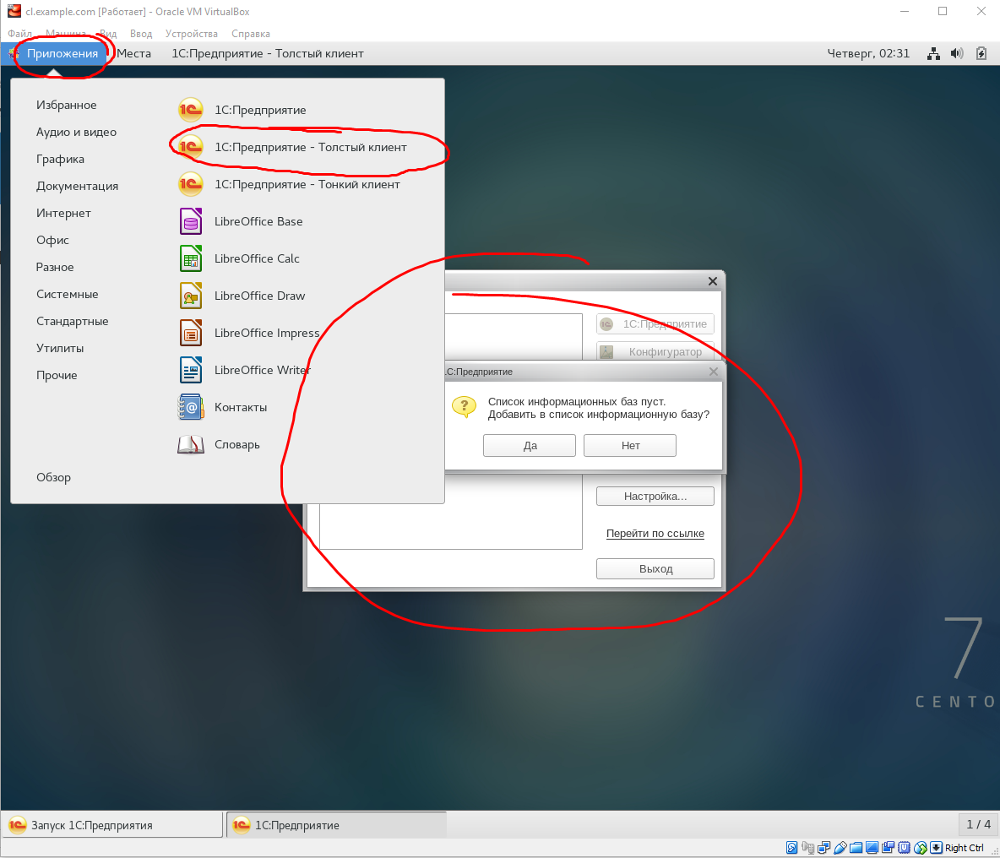
Клиентская часть работает на Linux!

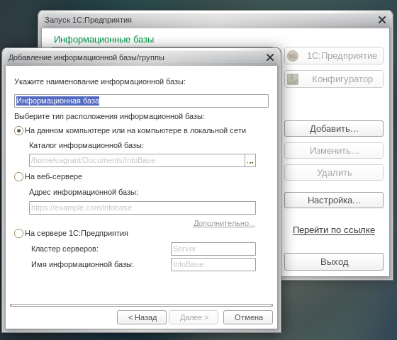
Клиент подключается к базе.

Итак клиентская часть платформы 1С:Предприятие работает. Теперь настало время взяться за серверную часть.


### Задача 3: Установка и настройка СУБД для сервера Платформы 1С:Предприятие на Linux

Поставим СУБД на сервер. Подключим репозиторий и поставим и преднастроим СУБД.

<https://postgrespro.ru/products/1c>

<https://postgrespro.ru/products/1c_build>

```
C:\VMs\ipa-lab\vagrant (master -> origin)
λ vagrant ssh srv
[vagrant@srv ~]$ sudo rpm -ivh http://1c.postgrespro.ru/keys/postgrespro-1c-centos96.noarch.rpm && sudo yum makecache && sudo yum install postgresql-pro-1c-9.6
...
[vagrant@srv ~]$
```

После установки дистрибутива для удобства администрирования сервера PostgreSQL рекомендуется прописать необходимые переменные окружения для пользователя postgres. Этот шаг необязателен.
Переключимся на пользователя postgres с его окружением:

```
[vagrant@srv ~]$ sudo -s
[root@srv vagrant]# su - postgres
-bash-4.2$ vi .bash_profile
-bash-4.2$
```

Открываем файл, в котором зададим необходимые переменные окружения:

```
vi .bash_profile
```

Добавляем в этот файл переменные:

```
export PATH=/usr/pgsql-9.6/bin:$PATH  
export MANPATH=/usr/pgsql-9.6/share/man:$MANPATH
```

Пример результата измененного файла:

```
[ -f /etc/profile ] && source /etc/profile
PGDATA=/var/lib/pgsql/9.6/data
export PGDATA

export PATH=/usr/pgsql-9.6/bin:$PATH
export MANPATH=/usr/pgsql-9.6/share/man:$MANPATH

# If you want to customize your settings,
# Use the file below. This is not overridden
# by the RPMS.
[ -f /var/lib/pgsql/.pgsql_profile ] && source /var/lib/pgsql/.pgsql_profile
```

Инициализируем служебные базы данных с русской локализацией (под пользователем postgres).

```
-bash-4.2$ initdb --locale=ru_RU.UTF-8
The files belonging to this database system will be owned by user "postgres".
This user must also own the server process.

The database cluster will be initialized with locale "ru_RU.UTF-8".
The default database encoding has accordingly been set to "UTF8".
The default text search configuration will be set to "russian".

Data page checksums are disabled.

fixing permissions on existing directory /var/lib/pgsql/9.6/data ... ok
creating subdirectories ... ok
selecting default max_connections ... 100
selecting default shared_buffers ... 128MB
selecting dynamic shared memory implementation ... posix
creating configuration files ... ok
running bootstrap script ... ok
performing post-bootstrap initialization ... ok
syncing data to disk ... ok

WARNING: enabling "trust" authentication for local connections
You can change this by editing pg_hba.conf or using the option -A, or
--auth-local and --auth-host, the next time you run initdb.

Success. You can now start the database server using:

    pg_ctl -D /var/lib/pgsql/9.6/data -l logfile start

-bash-4.2$ logout
```

Запуск сервера PostgreSQL 9.6.

```

[root@srv vagrant]# systemctl enable postgresql-9.6
postgresql-9.6.service is not a native service, redirecting to /sbin/chkconfig.
Executing /sbin/chkconfig postgresql-9.6 on
[root@srv vagrant]# systemctl start postgresql-9.6
[root@srv vagrant]# systemctl status postgresql-9.6
● postgresql-9.6.service - SYSV: PostgreSQL database server.
   Loaded: loaded (/etc/rc.d/init.d/postgresql-9.6; bad; vendor preset: disabled)
   Active: active (exited) since Thu 2018-10-04 03:44:45 +07; 5s ago
     Docs: man:systemd-sysv-generator(8)
  Process: 4162 ExecStart=/etc/rc.d/init.d/postgresql-9.6 start (code=exited, status=0/SUCCESS)

Oct 04 03:44:43 srv.example.com systemd[1]: Starting SYSV: PostgreSQL database server....
Oct 04 03:44:45 srv.example.com postgresql-9.6[4162]: Starting postgresql-9.6 service: [  OK  ]
Oct 04 03:44:45 srv.example.com systemd[1]: Started SYSV: PostgreSQL database server..
[root@srv vagrant]#
```

Изменение настроек сервера PostgreSQL

В файле /var/lib/pgsql/9.6/data/pg_hba.conf изменим строку

host all all 0.0.0.0/0 trusted
на
host all all 0.0.0.0/0 md5

для возможности пользователю postgres авторизовываться по паролю.

Далее в файле /var/lib/pgsql/9.6/data/postgresql.conf изменяем настройки под наши нужды. Редактируемые настройки:

shared_buffers = 512MB
temp_buffers = 16MB
work_mem = 128MB
maintenance_work_mem = 192MB
effective_cache_size = 3GB

Внимание! Подбор данных настроек производится индивидуально и зависит как от характеристик сервера, на котором будет работать сервер PostgreSQL, так и от характеристик информационных баз, которые будут обрабатываться на этом сервере.

Задаем пароль пользователю postgres, для того чтобы была возможность подключаться к серверу удаленно.

```
[root@srv vagrant]# su - postgres
Last login: Thu Oct  4 03:41:52 +07 2018 on pts/0
-bash-4.2$ psql
psql (9.6.10)
Type "help" for help.

postgres=# ALTER USER postgres WITH ENCRYPTED PASSWORD 'password';   #вместо 'password' поставьте нужный пароль
ALTER ROLE
postgres=# help;
You are using psql, the command-line interface to PostgreSQL.
Type:  \copyright for distribution terms
       \h for help with SQL commands
       \? for help with psql commands
       \g or terminate with semicolon to execute query
       \q to quit
postgres=# \q
-bash-4.2$ logout
[root@srv vagrant]#
```

Рестарт сервера PostgreSQL

```
[root@srv vagrant]# systemctl stop postgresql-9.6
[root@srv vagrant]# systemctl start postgresql-9.6
[root@srv vagrant]# systemctl status postgresql-9.6
● postgresql-9.6.service - SYSV: PostgreSQL database server.
   Loaded: loaded (/etc/rc.d/init.d/postgresql-9.6; bad; vendor preset: disabled)
   Active: active (exited) since Thu 2018-10-04 04:02:59 +07; 4s ago
     Docs: man:systemd-sysv-generator(8)
  Process: 4379 ExecStop=/etc/rc.d/init.d/postgresql-9.6 stop (code=exited, status=0/SUCCESS)
  Process: 4415 ExecStart=/etc/rc.d/init.d/postgresql-9.6 start (code=exited, status=0/SUCCESS)

Oct 04 04:02:57 srv.example.com systemd[1]: Starting SYSV: PostgreSQL database server....
Oct 04 04:02:59 srv.example.com postgresql-9.6[4415]: Starting postgresql-9.6 service: [  OK  ]
Oct 04 04:02:59 srv.example.com systemd[1]: Started SYSV: PostgreSQL database server..
[root@srv vagrant]#
```

Ура СУБД PostgreSQL 9.6 установлена, преднастроена и работает!
Теперь к базе на `srv.example.com` можно подключаться под пользователем `postgres` c паролем `password`.

### Задача 4: Установка компонентов сервера Платформы 1С:Предприятие на Linux

Поставим пакеты сервера. Для упрощения настройки и экономии ресурсов тестовой среды и веб-часть и Серверную часть и СУБД будет ставить на один сервер `srv.example.com`.
Вы можете легко расширить тестовую среду отредактировав `Vagrantfile`, запустить и преднастроить дополнительные сервера.
Для того, чтобы СУБД PostgreSQL запустилась и работала оптимально и без проблем, временно остановите `srv.example.com` командой `vagrant halt srv` и увеличьте количество ресурсов, выделяемых машине. Памяти увеличьте да 6GB, ядра поставьте 4. Запустите машину командой `vagrant up srv`.

>Внимание! Если вы выключите и снова включите машину не через vagrant, то каталог /vagrant будет пуст и вы не сможете поставить пакеты.
>В таком случае снова остановите сервер через `vagrant halt srv` и запустите его через `vagrant up srv`.

Поставим пакеты сервера 1С:Предприятие и веб сервер `apache`

```
[root@srv vagrant]# # Lets disable SELINUX May be some time later i will not disable SELinux but not this night Dan Walsh https://stopdisablingselinux.com/ , i am sorry but you need to weed some more time.
[root@srv vagrant]# sed -i --follow-symlinks 's/^SELINUX=.*/SELINUX=permissive/g' /etc/sysconfig/selinux && cat /etc/sysconfig/selinux
[root@srv vagrant]# setenforce 0
[root@srv vagrant]# ls -al /vagrant/distrib/all/
total 517188
drwxrwxrwx. 1 vagrant vagrant      4096 Oct  4 02:04 .
drwxrwxrwx. 1 vagrant vagrant      4096 Oct  4 02:10 ..
-rwxrwxrwx. 1 vagrant vagrant 155291374 Sep 16 09:10 1C_Enterprise83-client-8.3.13-1513.x86_64.rpm
-rwxrwxrwx. 1 vagrant vagrant  22308081 Sep 16 09:10 1C_Enterprise83-client-nls-8.3.13-1513.x86_64.rpm
-rwxrwxrwx. 1 vagrant vagrant  32932813 Sep 16 09:10 1C_Enterprise83-common-8.3.13-1513.x86_64.rpm
-rwxrwxrwx. 1 vagrant vagrant   6272534 Sep 16 09:10 1C_Enterprise83-common-nls-8.3.13-1513.x86_64.rpm
-rwxrwxrwx. 1 vagrant vagrant 237057486 Sep 16 09:10 1C_Enterprise83-server-8.3.13-1513.x86_64.rpm
-rwxrwxrwx. 1 vagrant vagrant  75461942 Sep 16 09:10 1C_Enterprise83-server-nls-8.3.13-1513.x86_64.rpm
-rwxrwxrwx. 1 vagrant vagrant    230780 Sep 16 09:10 1C_Enterprise83-ws-8.3.13-1513.x86_64.rpm
-rwxrwxrwx. 1 vagrant vagrant     18415 Sep 16 09:10 1C_Enterprise83-ws-nls-8.3.13-1513.x86_64.rpm
[root@srv vagrant]# mv  /vagrant/distrib/all/1C_Enterprise83-client-*.rpm /vagrant/distrib/8.3.13.1513_clientz.rpm64/

[root@srv vagrant]# ls -al /vagrant/distrib/all/
total 343748
drwxrwxrwx. 1 vagrant vagrant      4096 Oct  4 04:08 .
drwxrwxrwx. 1 vagrant vagrant      4096 Oct  4 02:10 ..
-rwxrwxrwx. 1 vagrant vagrant  32932813 Sep 16 09:10 1C_Enterprise83-common-8.3.13-1513.x86_64.rpm
-rwxrwxrwx. 1 vagrant vagrant   6272534 Sep 16 09:10 1C_Enterprise83-common-nls-8.3.13-1513.x86_64.rpm
-rwxrwxrwx. 1 vagrant vagrant 237057486 Sep 16 09:10 1C_Enterprise83-server-8.3.13-1513.x86_64.rpm
-rwxrwxrwx. 1 vagrant vagrant  75461942 Sep 16 09:10 1C_Enterprise83-server-nls-8.3.13-1513.x86_64.rpm
-rwxrwxrwx. 1 vagrant vagrant    230780 Sep 16 09:10 1C_Enterprise83-ws-8.3.13-1513.x86_64.rpm
-rwxrwxrwx. 1 vagrant vagrant     18415 Sep 16 09:10 1C_Enterprise83-ws-nls-8.3.13-1513.x86_64.rpm
[root@srv all]# yum localinstall *.rpm
Loaded plugins: fastestmirror
...
Installing:
 1C_Enterprise83-common         x86_64     8.3.13-1513       /1C_Enterprise83-common-8.3.13-1513.x86_64          79 M  
 1C_Enterprise83-common-nls     x86_64     8.3.13-1513       /1C_Enterprise83-common-nls-8.3.13-1513.x86_64      11 M  
 1C_Enterprise83-server         x86_64     8.3.13-1513       /1C_Enterprise83-server-8.3.13-1513.x86_64         459 M  
 1C_Enterprise83-server-nls     x86_64     8.3.13-1513       /1C_Enterprise83-server-nls-8.3.13-1513.x86_64     172 M  
 1C_Enterprise83-ws             x86_64     8.3.13-1513       /1C_Enterprise83-ws-8.3.13-1513.x86_64             530 k  
 1C_Enterprise83-ws-nls         x86_64     8.3.13-1513       /1C_Enterprise83-ws-nls-8.3.13-1513.x86_64         135 k
...
Installed:
  1C_Enterprise83-common.x86_64 0:8.3.13-1513             1C_Enterprise83-common-nls.x86_64 0:8.3.13-1513
  1C_Enterprise83-server.x86_64 0:8.3.13-1513             1C_Enterprise83-server-nls.x86_64 0:8.3.13-1513
  1C_Enterprise83-ws.x86_64 0:8.3.13-1513                 1C_Enterprise83-ws-nls.x86_64 0:8.3.13-1513

Complete!
[root@srv all]#
```


Теперь поставим шришты "Microsoft's Core Fonts" на наш сервер.
Или может появиться такое окошко при первом подключении.

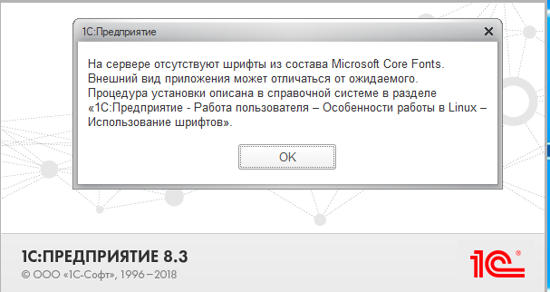

Почитать об этих шрифтах можно тут <http://mscorefonts2.sourceforge.net>

```
[vagrant@srv x86_64]$ sudo yum install -y epel-release
[vagrant@srv x86_64]$ sudo yum install -y curl cabextract xorg-x11-font-utils fontconfig
[vagrant@srv x86_64]$ sudo yum install https://downloads.sourceforge.net/project/mscorefonts2/rpms/msttcore-fonts-installer-2.6-1.noarch.rpm
```


Запуск сервера 1С.

```
[root@srv all]# systemctl enable srv1cv83
srv1cv83.service is not a native service, redirecting to /sbin/chkconfig.
Executing /sbin/chkconfig srv1cv83 on
[root@srv all]# systemctl start srv1cv83
[root@srv all]# systemctl status srv1cv83
  srv1cv83.service - SYSV: Starts and stops the 1C:Enterprise daemons
   Loaded: loaded (/etc/rc.d/init.d/srv1cv83; bad; vendor preset: disabled)
   Active: active (exited) since Thu 2018-10-04 04:12:16 +07; 20s ago
     Docs: man:systemd-sysv-generator(8)
  Process: 4584 ExecStart=/etc/rc.d/init.d/srv1cv83 start (code=exited, status=0/SUCCESS)

Oct 04 04:12:11 srv.example.com systemd[1]: Starting SYSV: Starts and stops the 1C:Enterprise daemons...
Oct 04 04:12:11 srv.example.com su[4597]: (to usr1cv8) root on none
Oct 04 04:12:16 srv.example.com srv1cv83[4584]: Starting 1C:Enterprise 8.3 server: OK
Oct 04 04:12:16 srv.example.com systemd[1]: Started SYSV: Starts and stops the 1C:Enterprise daemons.
[root@srv all]#
```

Высока вероятность, что сервер не запустится с первого раза, и при попытке запуска Вы получите ошибку вида:

Failed at step EXEC spawning /etc/rc.d/init.d/srv1cv83: Exec format error
Чтобы устранить эту ошибку, необходимо в скрипте инициализации сервера указать интерпретатор (например shell или bash), для этого необходимо добавить в начало файла /etc/init.d/srv1cv83 строку:

```
#!/bin/bash
```

Затем надо перезагрузить systemd для поиска новых или измененных юнитов:

```
systemctl daemon-reload
```

И снова попытаться запустить сервер 1С:Предприятие

```
systemctl restart srv1cv83.service
```

Но в нашем примере всё заработало с первого раза и без ошибок.

Установка дополнительных пакетов для корректной работы сервера 1С.

В документации сервера 1С:Предприятия описана утилита config_system, которая необходима для анализа готовности системы к запуску сервера 1С, в частности она помогает обнаружить отсутствующие необходимые пакеты для корректной работы сервера 1С. К сожалению, анализ rmp пакетов (rmp -ql) показал отсутствие данной утилиты в составе дистрибутива сервера 1С версии 8.3.9.1818. На всякой случай поставим пакеты и перезапустим сервисы.

```
[root@srv all]# yum install fontconfig-devel ImageMagick
...
[root@srv all]# systemctl stop srv1cv83
[root@srv all]# systemctl start srv1cv83
[root@srv all]# systemctl status srv1cv83
  srv1cv83.service - SYSV: Starts and stops the 1C:Enterprise daemons
   Loaded: loaded (/etc/rc.d/init.d/srv1cv83; bad; vendor preset: disabled)
   Active: active (exited) since Thu 2018-10-04 04:17:04 +07; 4s ago
     Docs: man:systemd-sysv-generator(8)
  Process: 5841 ExecStop=/etc/rc.d/init.d/srv1cv83 stop (code=exited, status=0/SUCCESS)
  Process: 5900 ExecStart=/etc/rc.d/init.d/srv1cv83 start (code=exited, status=0/SUCCESS)

Oct 04 04:16:59 srv.example.com systemd[1]: Starting SYSV: Starts and stops the 1C:Enterprise daemons...
Oct 04 04:16:59 srv.example.com su[5913]: (to usr1cv8) root on none
Oct 04 04:17:04 srv.example.com srv1cv83[5900]: Starting 1C:Enterprise 8.3 server: OK
Oct 04 04:17:04 srv.example.com systemd[1]: Started SYSV: Starts and stops the 1C:Enterprise daemons.
[root@srv all]#
```

Откроем порт для подключения к серверу.

```
[root@srv all]# systemctl disable firewalld
[root@srv all]# systemctl stop firewalld
[root@srv all]# systemctl mask firewalld
```

Поставим Веб сервер Платформы 1С:Предприятие

```
[vagrant@srv ~]$ sudo yum install httpd

[vagrant@srv ~]$ cd /opt/1C/v8.3/x86_64/
[vagrant@srv x86_64]$ ./webinst

1C:Предприятие 8. Утилита публикации веб-клиента

    Публикация:

    webinst [-publish] websrv -wsdir VirtualDir -dir Dir -connstr connStr [-confPath confPath]

    Публикация на основе существующего vrd файла:

    webinst [-publish] websrv [-wsdir VirtualDir] -descriptor vrdPath -dir Dir [-connstr connStr] [-confPath confPath]

    Удаление публикации:

    webinst -delete websrv -wsdir VirtualDir [-dir Dir] [-connstr connStr] [-confPath confPath]

    Удаление публикации по существующему vrd файлу:

    webinst -delete websrv [-wsdir VirtualDir] -descriptor vrdPath [-dir Dir] [-connstr connStr] [-confPath confPath]

    Ключи:

        -publish: опубликовать, ключ по умолчанию
        -delete: удалить публикацию
        websrv
            -apache2: публикация Веб-клиента для Apache 2.0
            -apache22: публикация Веб-клиента для Apache 2.2
            -apache24: публикация Веб-клиента для Apache 2.4
        -wsdir VirtualDir: виртуальный каталог
        -dir Dir: физический каталог, в который будет отображен виртуальный
        -descriptor vrdPath: путь к существующему vrd файлу
        -connstr connStr: строка соединения ИБ
        -confPath confPath: полный путь к конфигурационному файлу Apache

[vagrant@srv x86_64]$ sudo ./webinst -publish -apache24 -wsdir demo -dir '/var/www/html/demo/' -connstr 'Srvr="srv.example.com:1542";Ref="te st-base"' -confPath /etc/httpd/conf/httpd.conf

Publication successful
[vagrant@srv ~]$ sudo -s
[root@srv vagrant]# systemctl enable httpd
Created symlink from /etc/systemd/system/multi-user.target.wants/httpd.service to /usr/lib/systemd/system/httpd.service.
[root@srv vagrant]# systemctl start httpd
[root@srv vagrant]# systemctl status httpd
  httpd.service - The Apache HTTP Server
   Loaded: loaded (/usr/lib/systemd/system/httpd.service; enabled; vendor preset: disabled)
   Active: active (running) since Thu 2018-10-04 06:01:29 +07; 5s ago
     Docs: man:httpd(8)
           man:apachectl(8)
 Main PID: 4526 (httpd)
   Status: "Processing requests..."
   CGroup: /system.slice/httpd.service
           ├─4526 /usr/sbin/httpd -DFOREGROUND
           ├─4527 /usr/sbin/httpd -DFOREGROUND
           ├─4528 /usr/sbin/httpd -DFOREGROUND
           ├─4529 /usr/sbin/httpd -DFOREGROUND
           ├─4530 /usr/sbin/httpd -DFOREGROUND
           └─4531 /usr/sbin/httpd -DFOREGROUND

Oct 04 06:01:29 srv.example.com systemd[1]: Starting The Apache HTTP Server...
Oct 04 06:01:29 srv.example.com systemd[1]: Started The Apache HTTP Server.
[vagrant@srv ~]$ firewall-cmd --add-service=http --permanent
[vagrant@srv ~]$ firewall-cmd --add-service=https --permanent
[vagrant@srv ~]$ firewall-cmd --reload

```

Сервер 1С:Предприятие поставлен.

## Упражнение 3: Создание кластера и СУБД и проверка работоспособности

Переключимся на Windows10 рабочую станцию `wincl.domain.com`. И запустим утилиту администрирования серверов Платформы 1С:Предприятия.

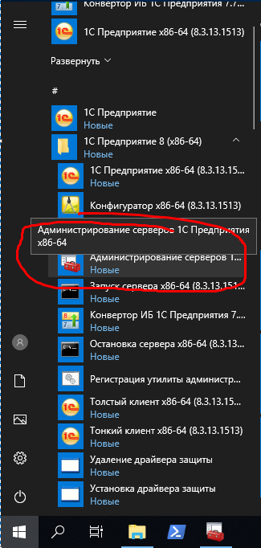
утилиту администрирования серверов Платформы 1С:Предприятия. Запуск.

Необходимо указать имя сервера (прописанное в hosts) и порт 1540 (используется по умолчанию):

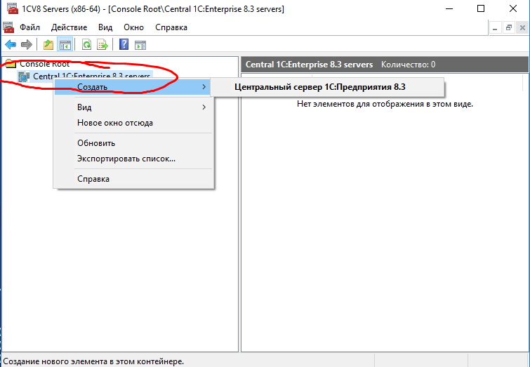
Меню подключения к серверу 1С.

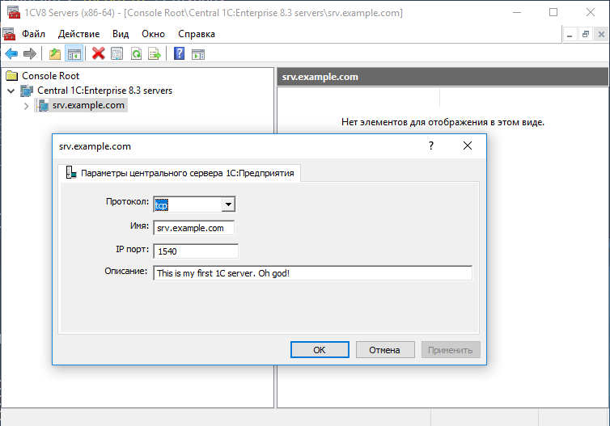
Свойства подключения к серверу 1С.

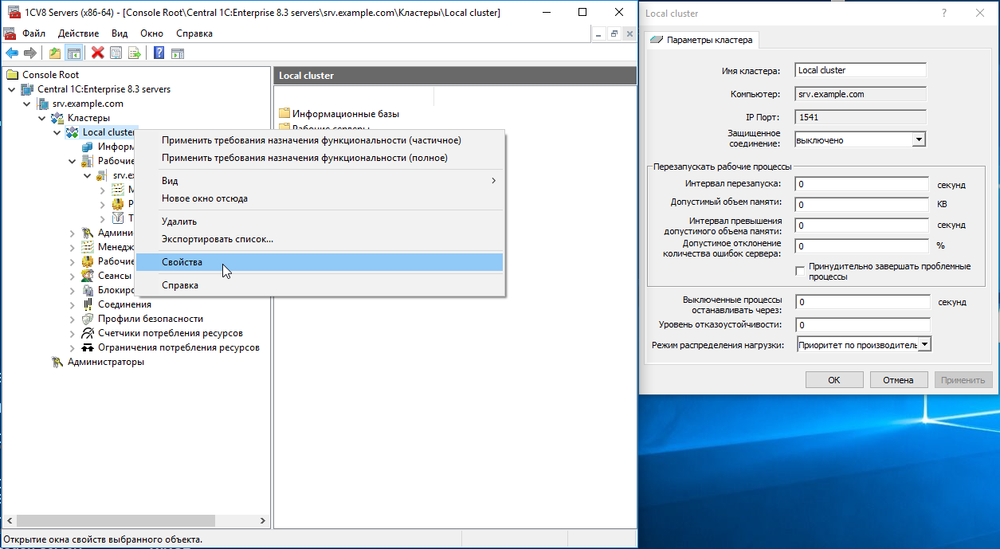
Окно свойств локального кластера srv.example.com

Для создания нового кластера необходимо указать:

- произвольное имя кластера
- имя центрального сервера, на котором располагается кластер (прописанный в hosts)
- порт 1541 (используется по умолчанию)

Создание базы на кластере сервера 1С.
Необходимо указать:

- имя базы на кластере 1С
- имя сервера баз данных (разрешаемое в IP адрес, имя сервера)
- тип СУБД ( В данной практике выберите PostgeSQL)
- имя базы данных на сервере СУБД
- пользователь сервера СУБД (в нашем случае postgres)
- пароль указанного пользователя сервера СУБД

При необходимости можно отметить пункт «Создать базу с случае ее отсутствия»

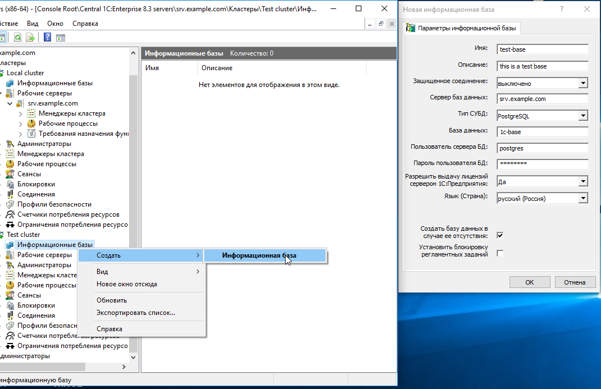
Администратор Серверов: Создание базы в кластере srv.example.com

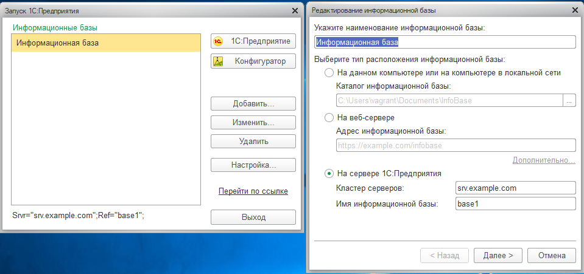
Подключение к серверу из Windows. Сервер: srv.example.com База: Base1

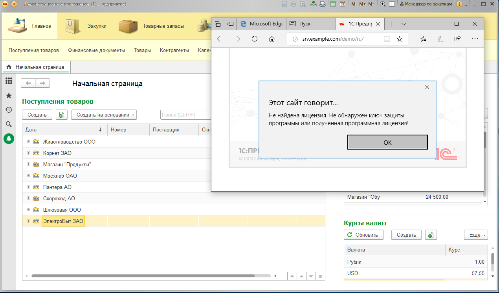
Подключение к 1С:Предприятие Windows клиентом: Открыта Демо база и работает веб клиент

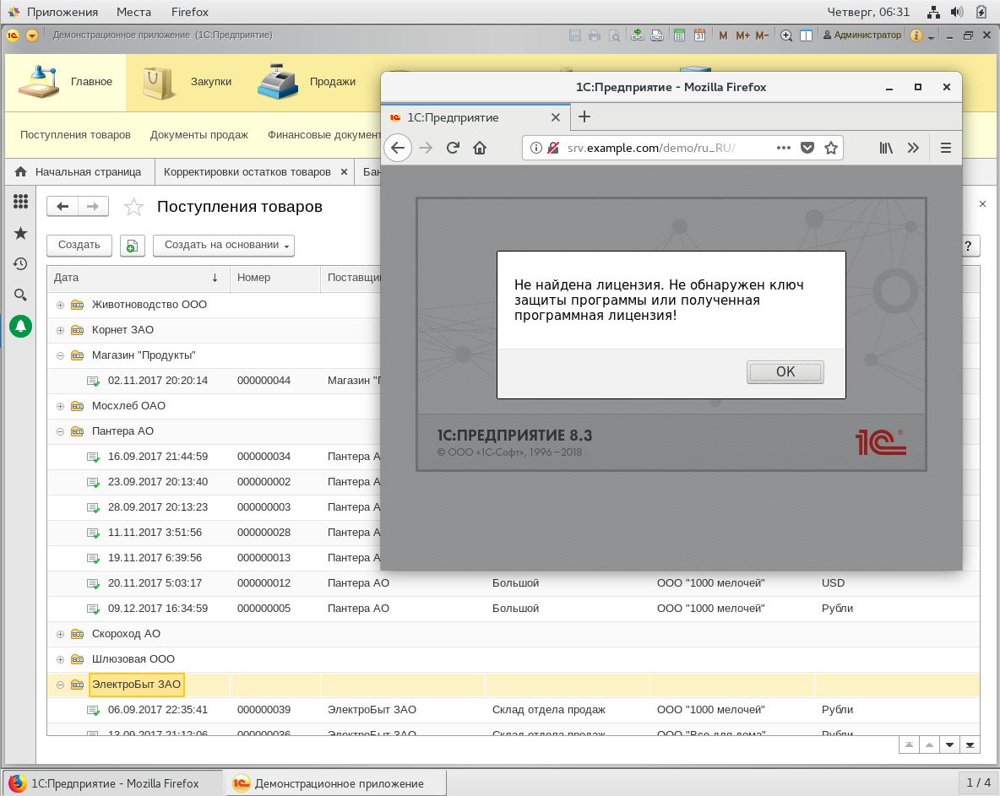
Подключение к 1С:Предприятие Linux клиент: Открыта Демо база и работает веб клиент
