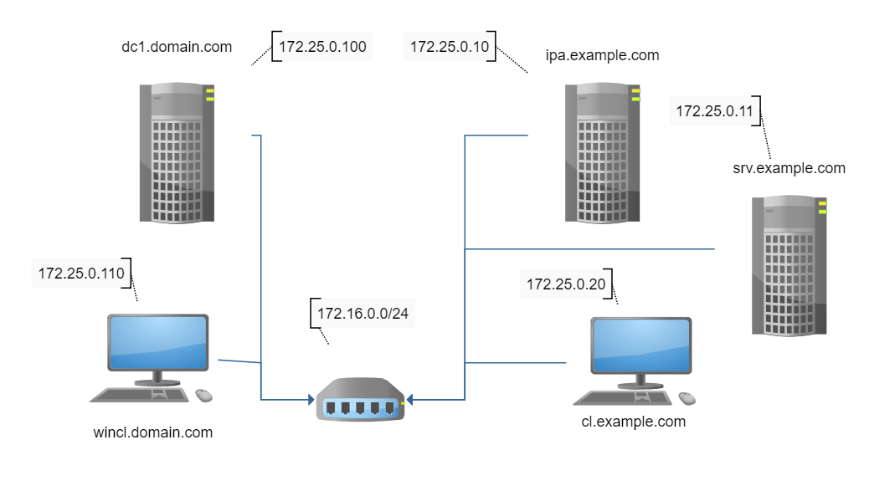
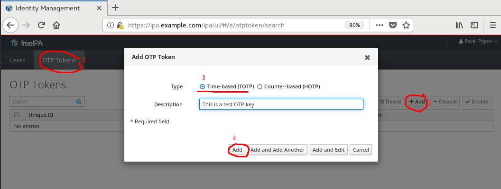
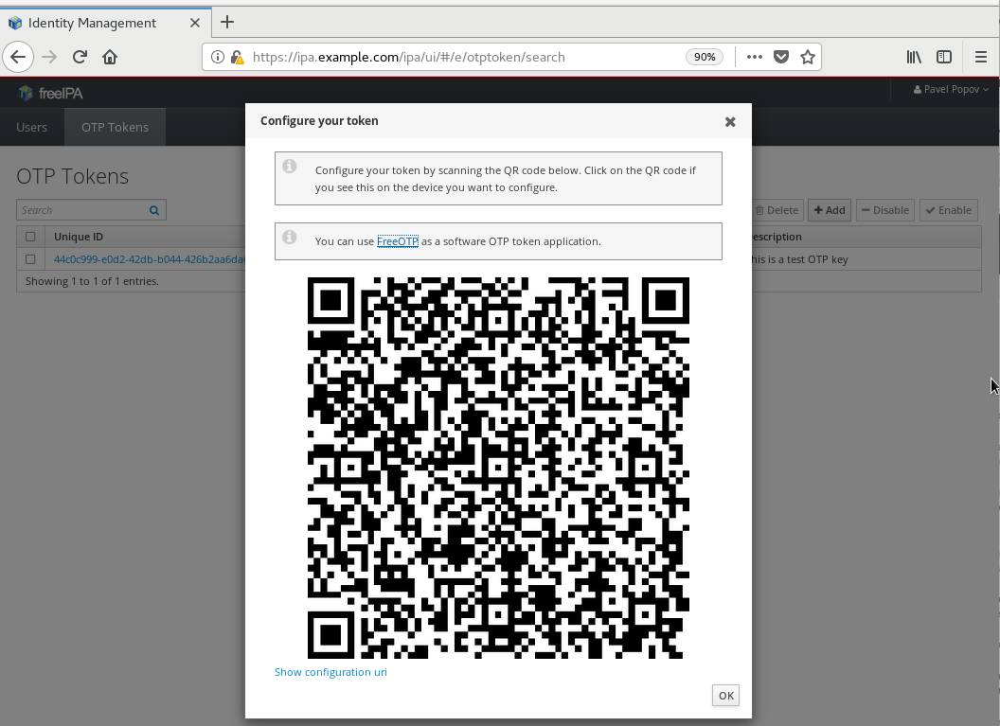
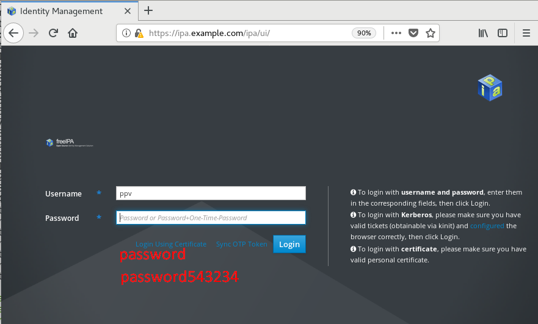
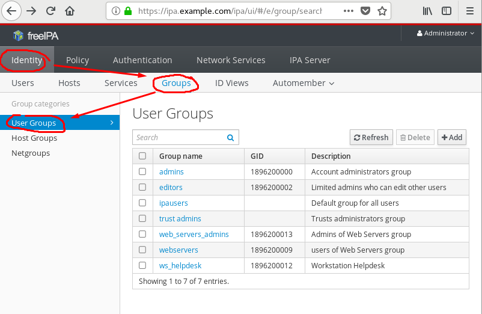
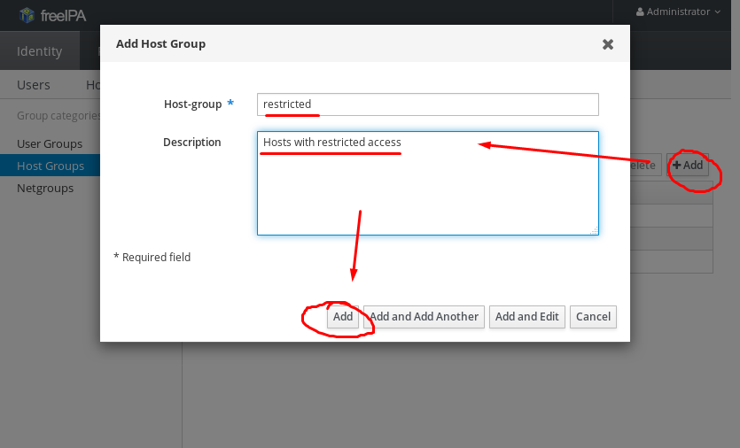
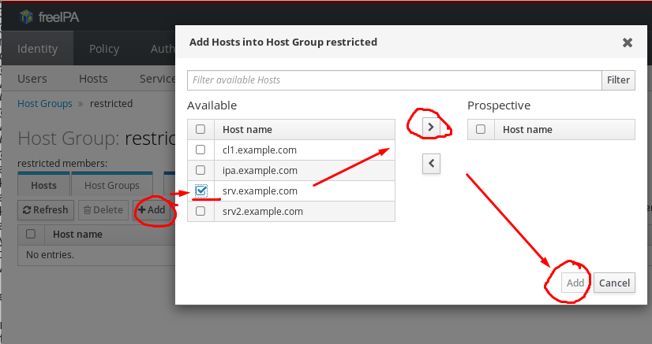
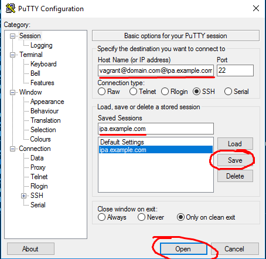
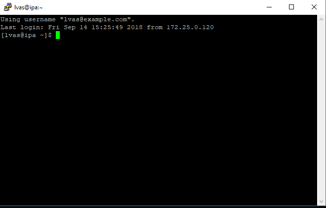

# Интеграция GNU/Linux IPA с Microsoft Active Directory

Отделу IT в компании "РиК" была поставлена задача централизованного управления учетными данными всех рабочих станций и серверов, работающих как GNU/Linux, так и на Microsoft Windows. В компании в данный момент работает Active Directory домен и все сервера и рабочие станции с Microsoft Windows были добавлены в него. Необходимо настроить централизованную аутентификацию как клиентов, так и серверов. Для решения данной задачи со стороны GNU/Linux был выбран FreeIPA сервер. Также предполагается настроить централизованное управление правами доступа, и правилами sudo для клиентов и серверов.

 По окончанию данной лабораторной работы вы сможете:

- Установить и настроить FreeIPA сервер
- Создавать пользователей, группы, настроить парольные политики.
- Настроить двухфакторную аутентификацию при входе.
- Установить клиента FreeIPA и подключить компьютер у FreeIPA домену.
- Управлять пользователями и группами хостов.
- Интегрировать FreeIPA с Active Directory.
- Настроить роли и права администраторов FreeIPA домена.
- Создать высокодоступную конфигурацию FreeIPA домена, состоящую из двух серверов с настроенной репликацией.
- Настроить Web, Smb, Nfs сервисы на работу cовместно с FreeIPA доменом.

# Оглавление

<!-- TOC -->

- [Интеграция GNU/Linux IPA с Microsoft Active Directory](#интеграция-gnulinux-ipa-с-microsoft-active-directory)
- [Оглавление](#оглавление)
    - [Упражнение 1: Установка и настройка FreeIPA сервера и домена](#упражнение-1-установка-и-настройка-freeipa-сервера-и-домена)
        - [Задача 1: Предварительная подготовка разрешения имен и установка пакетов](#задача-1-предварительная-подготовка-разрешения-имен-и-установка-пакетов)
        - [Задача 2. Настройка FreeIPA сервера](#задача-2-настройка-freeipa-сервера)
            - [Задача 3. Проверка установки на ошибки. Решение типовых проблем](#задача-3-проверка-установки-на-ошибки-решение-типовых-проблем)
    - [Упражнение 2: Создание пользователей, настройка парольных политик. Двухфакторная аутентификация](#упражнение-2-создание-пользователей-настройка-парольных-политик-двухфакторная-аутентификация)
        - [Задача 1: Управление пользователями](#задача-1-управление-пользователями)
        - [Задача 2: Настройка парольных политик](#задача-2-настройка-парольных-политик)
        - [Задача 3: Настройка FreeOTP на FreeIPA сервере](#задача-3-настройка-freeotp-на-freeipa-сервере)
            - [Настройка двухфакторной аутентификации FreeOTP на IPA сервере](#настройка-двухфакторной-аутентификации-freeotp-на-ipa-сервере)
            - [Регистрация OTP токена безопасности в приложении `FreeOTP Authentificator`](#регистрация-otp-токена-безопасности-в-приложении-freeotp-authentificator)
            - [Проверка входа с помощью одноразового пароля](#проверка-входа-с-помощью-одноразового-пароля)
    - [Упражнение 3: Подключение серверов и рабочих станций к FreeIPA домену](#упражнение-3-подключение-серверов-и-рабочих-станций-к-freeipa-домену)
        - [Задача 1: Подключение к домену. Установка и настройка пакетов](#задача-1-подключение-к-домену-установка-и-настройка-пакетов)
        - [Задача 2. Установка настройка Samba, NFS и HTTP Apache сервисов, интегрированных с IPA](#задача-2-установка-настройка-samba-nfs-и-http-apache-сервисов-интегрированных-с-ipa)
            - [Установка пакетов, создание SPN-записей, генерация keytab-файлов](#установка-пакетов-создание-spn-записей-генерация-keytab-файлов)
            - [Настройка NFS сервера с поддержкой аутентификации Kerberos и autofs ("Kerberized NFS Server")](#настройка-nfs-сервера-с-поддержкой-аутентификации-kerberos-и-autofs-kerberized-nfs-server)
            - [Настройка OpenSSH сервера с поддержкой аутентификации Kerberos](#настройка-openssh-сервера-с-поддержкой-аутентификации-kerberos)
            - [Настройка Samba сервера с sssd и аутентификацией IPA](#настройка-samba-сервера-с-sssd-и-аутентификацией-ipa)
            - [Настройка веб сервера Apache с HTTPS и Kerberos аутентификацией](#настройка-веб-сервера-apache-с-https-и-kerberos-аутентификацией)
    - [Упражнение 4: Управление группами пользователей и хостов](#упражнение-4-управление-группами-пользователей-и-хостов)
    - [Упражнение 5: Интеграция IPA домена с Active Directory](#упражнение-5-интеграция-ipa-домена-с-active-directory)

<!-- /TOC -->

 Описание тестовой среды
  


 Предположительное время: 1 час 30 минут
Виртуальные машины: ipa.example.com, cl.example.com, srv.example.com, dc.domain.com, wincl.domain.com

| Логин   | Пароль  |
| ---     | ---     |
| root    | redhat  |
| vagrant | vagrant |
| DOMAIN\vagrant | vagrant |

## Упражнение 1: Установка и настройка FreeIPA сервера и домена
  
В данный момент в компании "РиК" не установлен FreeIPA сервер и домен. Необходимо произвести его установку и предварительную настройку.

1. Предварительная подготовка разрешения имен и установка пакетов
2. Настройка FreeIPA сервера
3. Проверка установки на ошибки. Решение типовых проблем.

### Задача 1: Предварительная подготовка разрешения имен и установка пакетов

 Выполните вход в систему на виртуальной машине `ipa.example.com`, используя учетную запись `vagrant` и пароль `vagrant`.


Убедитесь, что в файле /etc/hosts находятся строки

```bash
127.0.0.1    localhost.localdomain localhost
172.25.0.10  ipa.example.com       ipa

```

Если в файле уже существовали строки с текстом `ipa`, то замените их.
Если таких строк там нет, то добавьте их.

```bash
[vagrant@ipa ~]$ sudo sed -i /.*ipa.*/d /etc/hosts
[vagrant@ipa ~]$ sudo echo '172.25.0.10  ipa.example.com  ipa' >> /etc/hosts
```

 Настроим разрешение имен сервера `ipa.example.com` на localhost.

```bash
[vagrant@ipa ~]$ sudo nmcli conn modify System\ eth0 ipv4.ignore-auto-dns true
[vagrant@ipa ~]$ sudo nmcli conn up System\ eth0
[vagrant@ipa ~]$ sudo nmcli conn modify System\ eth1 ipv4.dns 127.0.0.1
[vagrant@ipa ~]$ sudo nmcli conn up System\ eth1
[vagrant@ipa ~]$ cat /etc/resolv.conf
# Generated by NetworkManager
search example.com
nameserver 127.0.0.1
```

Установите пакеты, необходимые для FreeIPA сервера

```less
 [vagrant@ipa ~]$ sudo yum -y install bind bind-utils bind-dyndb-ldap ipa-server ipa-server-dns
```

### Задача 2. Настройка FreeIPA сервера

1. Запустите настройку из из под суперпользователя

```less
[vagrant@ipa ~]$ sudo ipa-server-install --setup-dns --ssh-trust-dns --mkhomedir --allow-zone-overlap
```

Ответьте на вопросы помощника так, как показано в примере

````bash
...
Server host name [idm-server.example.com]: <Enter>
...
Please confirm the domain name [example.com]: <Enter>
...
Please provide a realm name [EXAMPLE.COM]: <Enter>
... Directory Manager password: < "password" >
Password (confirm): < "password" >
...
IPA admin password: < "password" >
Password (confirm): < "password" >
...
Do you want to configure DNS forwarders? [yes]: Yes
...
Enter IP address for a DNS forwarder: <Enter>
...
Do you want to configure the reverse zone? [yes]: Yes
...
Continue to configure the system with these values? [no]: Yes
...
Domain name: example.com
````

В конце мастера должны получить примерно такое сообщение

````bash
The IPA Master Server will be configured with:
Hostname:       ipa.example.com
IP address(es): 172.25.0.10
Domain name:    example.com
Realm name:     EXAMPLE.COM

BIND DNS server will be configured to serve IPA domain with:
Forwarders:       No forwarders
Forward policy:   only
Reverse zone(s):  0.25.172.in-addr.arpa.

Continue to configure the system with these values? [no]: Yes
...
...
The ipa-client-install command was successful

==============================================================================
Setup complete

Next steps:
        1. You must make sure these network ports are open:
                TCP Ports:
                  * 80, 443: HTTP/HTTPS
                  * 389, 636: LDAP/LDAPS
                  * 88, 464: kerberos
                  * 53: bind
                UDP Ports:
                  * 88, 464: kerberos
                  * 53: bind
                  * 123: ntp

        2. You can now obtain a kerberos ticket using the command: 'kinit admin'
           This ticket will allow you to use the IPA tools (e.g., ipa user-add)
           and the web user interface.

Be sure to back up the CA certificates stored in /root/cacert.p12
These files are required to create replicas. The password for these
files is the Directory Manager password
[vagrant@ipa ~]$
````

Вместе с FreeIPA сервером установились некоторые дополнительные службы, такие как `389 Directory Server`, `MIT Kerberos Server`, `ISC BIND 9`,`HTTP Apache Server`, и т.д. Проверим утилитой `ipactl`, что их службы запущены и работают. С помощью утилиты `ipactl` вы можете управлять всеми службами сервера, что имеют отношение к работе FreeIPA.

```bash
[vagrant@ipa ~]$ sudo ipactl status
Directory Service: RUNNING
krb5kdc Service: RUNNING
kadmin Service: RUNNING
named Service: RUNNING
httpd Service: RUNNING
ipa-custodia Service: RUNNING
ntpd Service: RUNNING
pki-tomcatd Service: RUNNING
ipa-otpd Service: RUNNING
ipa-dnskeysyncd Service: RUNNING
ipa: INFO: The ipactl command was successful
```

Проверим, что DNS PTR записи в обратной зоне dns `0.25.172.in-addr.apra` будут создаваться/обновляться при присоединении компьютеров.

```bash
[vagrant@ipa ~]$  ipa dnszone-mod example.com --allow-sync-ptr=true
  Zone name: example.com.
  Active zone: TRUE
  Authoritative nameserver: ipa.example.com.
  Administrator e-mail address: hostmaster.example.com.
  SOA serial: 1536572066
  SOA refresh: 3600
  SOA retry: 900
  SOA expire: 1209600
  SOA minimum: 3600
  Allow query: any;
  Allow transfer: none;
  Allow PTR sync: TRUE
```

Копия всех сообщений пишется в файл журнала /var/log/ipaserver-install.log.

Откроем необходимые порты для FreeIPA сервера в firewalld

```less
[vagrant@ipa ~]$ sudo firewall-cmd --add-service=http --permanent
[vagrant@ipa ~]$ sudo firewall-cmd --add-service=https --permanent
[vagrant@ipa ~]$ sudo firewall-cmd --add-service=freeipa-ldap --permanent
[vagrant@ipa ~]$ sudo firewall-cmd --add-service=freeipa-ldaps --permanent
[vagrant@ipa ~]$ sudo firewall-cmd --add-service=freeipa-replication --permanent
[vagrant@ipa ~]$ sudo firewall-cmd --add-service=freeipa-trust --permanent
[vagrant@ipa ~]$ sudo firewall-cmd --add-service=kerberos --permanent
[vagrant@ipa ~]$ sudo firewall-cmd --add-service=dns --permanent
[vagrant@ipa ~]$ sudo firewall-cmd --add-service=ntp --permanent
[vagrant@ipa ~]$ sudo firewall-cmd --reload
```

#### Задача 3. Проверка установки на ошибки. Решение типовых проблем

Проделайте действия на: cl.example.com

- Зайдите интерактивно в среду рабочего стола "Gnome Enviroment"с логином `vagrant` и паролем `vagrant`.

- Ответьте по умолчанию на вопросы мастера начальной настройки "Gnome Enviroment".

- Настройте разрешение имен dns через ipa сервер `ipa.example.com`

Запустите "Gnome Terminal" и дайте команды

```bash
[vagrant@cl ~]$ sudo nmcli conn modify System\ eth0 ipv4.ignore-auto-dns true
[vagrant@cl ~]$ sudo nmcli conn up System\ eth0
[vagrant@cl ~]$ sudo nmcli conn modify System\ eth1 ipv4.dns 172.25.0.10
[vagrant@cl ~]$ sudo nmcli conn up System\ eth1
```

Убедитесь, что файл /etc/resolv.conf теперь содержит такие строки.

```bash
[vagrant@ipa ~]$ cat /etc/resolv.conf
```

```text
# Generated by NetworkManager
search example.com
nameserver 172.25.0.10
```

Проверим, что имя сервера `ipa.example.com` теперь разрешается со стороны клиента.

```bash
[vagrant@cl ~]$ nslookup ipa.example.com
Server:   172.25.0.10
Address:  172.25.0.10#54

Name: ipa.example.com
Address: 172.25.0.10
```

- Проверим возможность подключиться к веб-интерфейсу настройки FreeIPA сервера с помощью веб-браузера.

Запустите `Firefox Web Browser` и откройте <https://ipa.example.com>. В окне "Your Connection is not secure" нажмите *Advanced* --> *Add Exception...* --> *Confirm Security Exception*. В форме доступа введите ранее указанный в мастере настройки логин администратора FreeIPA домена `admin` и его пароль `password`.
Должно появиться такое окно.


Веб-интерфейс FreeIPA сервера мультиязычен. Русский язык в веб-интерфейса можно отобразить, если в настройках браузера в списке предпочитаемых языков для запрашиваемых страниц добавить первым "Русский язык"


Пока мы только проверили возможность открыть веб-интерфейс. Ничего делать внутри пока нет необходимости.

Проделайте действия на : ipa.example.com

- Получите билет Kerberos

```bash
[vagrant@ipa ~]$ kinit admin
Password for admin@EXAMPLE.COM:
[vagrant@ipa ~]$ klist
Ticket cache: KEYRING:persistent:1000:1000
Default principal: admin@EXAMPLE.COM

Valid starting       Expires              Service principal
09/06/2018 04:46:51  09/07/2018 04:46:48  krbtgt/EXAMPLE.COM@EXAMPLE.COM
```

- Проверьте созданные ресурсные записи на DNS сервере

````bash
[vagrant@ipa ~]$ ipa dnszone-find
  Zone name: 0.25.172.in-addr.arpa.
  Active zone: TRUE
  Authoritative nameserver: ipa.example.com.
  Administrator e-mail address: hostmaster.example.com.
  SOA serial: 1536149776
  SOA refresh: 3600
  SOA retry: 900
  SOA expire: 1209600
  SOA minimum: 3600
  Allow query: any;
  Allow transfer: none;

  Zone name: example.com.
  Active zone: TRUE
  Authoritative nameserver: ipa.example.com.
  Administrator e-mail address: hostmaster.example.com.
  SOA serial: 1536149809
  SOA refresh: 3600
  SOA retry: 900
  SOA expire: 1209600
  SOA minimum: 3600
  Allow query: any;
  Allow transfer: none;
----------------------------
Number of entries returned 2
----------------------------
[vagrant@ipa ~]$ ipa dnsrecord-find example.com --name=ipa  --all
  dn: idnsname=ipa,idnsname=example.com.,cn=dns,dc=example,dc=com
  Record name: ipa
  Time to live: 1200
  A record: 172.25.0.10
  SSHFP record: 1 1 B4A11E2F2AFB8EF4F3ACF513C199B051EA5AB7A4, 1 2
                C80E2D1676FDF8D544370566D2EE20BD6D41F7434314D6C668019A0D 65AAD7A8, 3 1
                20522BE298E2ED30EA8C3330AD8B3C5714889F3D, 3 2 58E31BACE0277621DE153B24A82E3FB5C5A715DFBC0E55F1D94F4D90
                73BD2B4E, 4 1 7A0D4855C74C0BE213E8968D0CE5ADEE6ED5C063, 4 2
                F34432C411D5DDEB0325AFC2C1C7032D36D87330982B96484EF0313B 7DC58B29
  objectclass: top, idnsrecord
----------------------------
Number of entries returned 1
----------------------------
````

- Проверьте настройки по умолчанию

```bash
[vagrant@ipa ~]$ ipa config-show
  Maximum username length: 32
  Home directory base: /home
  Default shell: /bin/sh
  Default users group: ipausers
  Default e-mail domain: example.com
  Search time limit: 2
  Search size limit: 100
  User search fields: uid,givenname,sn,telephonenumber,ou,title
  Group search fields: cn,description
  Enable migration mode: FALSE
  Certificate Subject base: O=EXAMPLE.COM
  Password Expiration Notification (days): 4
  Password plugin features: AllowNThash, KDC:Disable Last Success
  SELinux user map order: guest_u:s0$xguest_u:s0$user_u:s0$staff_u:s0-s0:c0.c1023$unconfined_u:s0-s0:c0.c1023
  Default SELinux user: unconfined_u:s0-s0:c0.c1023
  Default PAC types: MS-PAC, nfs:NONE
  IPA masters: ipa.example.com
  IPA CA servers: ipa.example.com
  IPA NTP servers: ipa.example.com
  IPA CA renewal master: ipa.example.com
  IPA master capable of PKINIT: ipa.example.com

```

Изменим командную оболочку по умолчанию с `/bin/sh` на привычную в GNU/Linux `/bin/bash`.

```bash
[vagrant@ipa ~]$ ipa config-mod --defaultshell=/bin/bash
...
  Default shell: /bin/bash
...
```

- В случае проблем, проверьте содержимое файлов журналов на ошибки

````bash
/var/log/pki-ca/debug
/var/log/pki-ca-install.log #Журнал установки Центра Сертификации DogTag CA
/var/log/dirsrv/ #Каталог журналов, куда попадают сообщения службы каталога
/var/log/messages
````

- Типовые ошибки во время установки:
  - Неправильные настройки разрешенения имен DNS.
  - Файлы конфигурации и сертификатов, оставшиеся с предыдущих установок FreeIPA.
  - Проблемы синхронизации времени.

## Упражнение 2: Создание пользователей, настройка парольных политик. Двухфакторная аутентификация
  
FreeIPA домен создан. Теперь нужно завести в нём пользователей и задать им политики паролей. Настроить двухфакторную аутентификацию.

1. Управление пользователями
2. Создание парольных политик
3. Настройка Двухфакторной аутентификации

### Задача 1: Управление пользователями

Создадим пользователей внутри FreeIPA домена с помощью инструментов командной строки.

```bash
[vagrant@ipa ~]$ ipa user-add
First name: Ivan
Last name: Petrov
User login [ipetrov]:
--------------------
Added user "ipetrov"
--------------------
  User login: ipetrov
  First name: Ivan
  Last name: Petrov
  Full name: Ivan Petrov
  Display name: Ivan Petrov
  Initials: IP
  Home directory: /home/ipetrov
  GECOS: Ivan Petrov
  Login shell: /bin/bash
  Principal name: ipetrov@EXAMPLE.COM
  Principal alias: ipetrov@EXAMPLE.COM
  Email address: ipetrov@example.com
  UID: 1896200004
  GID: 1896200004
  Password: False
  Member of groups: ipausers
  Kerberos keys available: False
```

```bash
[vagrant@ipa ~]$ ipa user-add --first=Pavel --last=Popov ppv
----------------
Added user "ppv"
----------------
  User login: ppv
  First name: Pavel
  Last name: Popov
  Full name: Pavel Popov
  Display name: Pavel Popov
  Initials: PP
  Home directory: /home/ppv
  GECOS: Pavel Popov
  Login shell: /bin/bash
  Principal name: ppv@EXAMPLE.COM
  Principal alias: ppv@EXAMPLE.COM
  Email address: ppv@example.com
  UID: 1896200007
  GID: 1896200007
  Password: False
  Member of groups: ipausers
  Kerberos keys available: False
```

```bash
[vagrant@ipa ~]$ ipa user-add   --first=Larisa \
                                --last=Vasileva \
                                --manager=ppopov \
                                --email=lvas@example.com \
                                --homedir=/home/lvas lvas
-----------------
Added user "lvas"
-----------------
  User login: lvas
  First name: Larisa
  Last name: Vasileva
  Full name: Larisa Vasileva
  Display name: Larisa Vasileva
  Initials: LV
  Home directory: /home/lvas
  GECOS: Larisa Vasileva
  Login shell: /bin/bash
  Principal name: lvas@EXAMPLE.COM
  Principal alias: lvas@EXAMPLE.COM
  Email address: lvas@example.com
  UID: 1896200006
  GID: 1896200006
  Manager: ppopov
  Password: False
  Member of groups: ipausers
  Kerberos keys available: False
```

Изменим параметры пользователей через командную строку.

```bash
[vagrant@ipa ~]$ ipa user-show ppv
  User login: ppv
  First name: Pavel
  Last name: Popov
  Home directory: /home/ppv
  Login shell: /bin/bash
  Principal name: ppv@EXAMPLE.COM
  Principal alias: ppv@EXAMPLE.COM
  Email address: ppv@example.com
  UID: 1896200007
  GID: 1896200007
  Account disabled: False
  Password: False
  Member of groups: ipausers
  Kerberos keys available: False
```

```bash
[vagrant@ipa ~]$ ipa user-mod ppv --addattr=l="Moscow"
-------------------
Modified user "ppv"
-------------------
  User login: ppv
  First name: Pavel
  Last name: Popov
  Home directory: /home/ppv
  Login shell: /bin/bash
  Principal name: ppv@EXAMPLE.COM
  Principal alias: ppv@EXAMPLE.COM
  Email address: ppv@example.com
  UID: 1896200007
  GID: 1896200007
  City: Moscow
  Account disabled: False
  Password: False
  Member of groups: ipausers
  Kerberos keys available: False
```

```bash
[vagrant@ipa ~]$ ipa user-mod ppv --addattr=title="Manager"
-------------------
Modified user "ppv"
-------------------
  User login: ppv
  First name: Pavel
  Last name: Popov
  Home directory: /home/ppv
  Login shell: /bin/bash
  Principal name: ppv@EXAMPLE.COM
  Principal alias: ppv@EXAMPLE.COM
  Email address: ppv@example.com
  UID: 1896200007
  GID: 1896200007
  Job Title: Manager
  Account disabled: False
  Password: False
  Member of groups: ipausers
  Kerberos keys available: False
```

Установим пользователям пароль для первоначального входа.

```bash
[vagrant@ipa ~]$ ipa user-mod ppv --password
Password: <Введите `initialpass`>
Enter Password again to verify: <Введите `initialpass`>
-------------------
Modified user "ppv"
-------------------
  User login: ppv
  First name: Pavel
  Last name: Popov
  Home directory: /home/ppv
  Login shell: /bin/bash
  Principal name: ppv@EXAMPLE.COM
  Principal alias: ppv@EXAMPLE.COM
  Email address: ppv@example.com
  UID: 1896200007
  GID: 1896200007
  Job Title: Manager
  Account disabled: False
  Password: True
  Member of groups: ipausers
  Kerberos keys available: True
[vagrant@ipa ~]$

[vagrant@ipa ~]$ ipa user-mod lvas --password
...
[vagrant@ipa ~]$ ipa user-mod ipetrov --password
...

```

Убедимся, что доменные пользователи были созданы.

```bash
[vagrant@ipa ~]$ id ppv
uid=1896200007(ppv) gid=1896200007(ppv) groups=1896200007(ppv)
[vagrant@ipa ~]$ id lvas
uid=1896200006(lvas) gid=1896200006(lvas) groups=1896200006(lvas)
[vagrant@ipa ~]$ id ipetrov
uid=1896200004(ipetrov) gid=1896200004(ipetrov) groups=1896200004(ipetrov)
[vagrant@ipa ~]$ getent passwd ppv
ppv:*:1896200007:1896200007:Pavel Popov:/home/ppv:/bin/bash
[vagrant@ipa ~]$ getent passwd lvas
lvas:*:1896200006:1896200006:Larisa Vasileva:/home/lvas:/bin/bash
[vagrant@ipa ~]$ getent passwd ipetrov
ipetrov:*:1896200004:1896200004:Ivan Petrov:/home/ipetrov:/bin/bash
```

Частные пользовательские группы также были созданы.

```bash
[vagrant@ipa ~]$ getent group ipetrov
ipetrov:*:1896200004:
[vagrant@ipa ~]$ getent group ppv
ppv:*:1896200007:
[vagrant@ipa ~]$ getent group lvas
lvas:*:1896200006:
[vagrant@ipa ~]$ getent group ipetrov
ipetrov:*:1896200004:**
```

Проверим свойства пользователей через веб-консоль администратора.


Редактировать параметры пользователя можно, если кликнуть курсором мыши по имени пользователя.


### Задача 2: Настройка парольных политик

Для начала посмотрим справку о парольных политиках, запустив команду

```bash
[vagrant@ipa ~]$ ipa help pwpolicy
Password policy

A password policy sets limitations on IPA passwords, including maximum
lifetime, minimum lifetime, the number of passwords to save in
history, the number of character classes required (for stronger passwords)
and the minimum password length.

By default there is a single, global policy for all users. You can also
create a password policy to apply to a group. Each user is only subject
to one password policy, either the group policy or the global policy. A
group policy stands alone; it is not a super-set of the global policy plus
custom settings.

Each group password policy requires a unique priority setting. If a user
is in multiple groups that have password policies, this priority determines
which password policy is applied. A lower value indicates a higher priority
policy.

Group password policies are automatically removed when the groups they
are associated with are removed.

EXAMPLES:

 Modify the global policy:
   ipa pwpolicy-mod --minlength=10

 Add a new group password policy:
   ipa pwpolicy-add --maxlife=90 --minlife=1 --history=10 --minclasses=3 --minlength=8 --priority=10 localadmins

 Display the global password policy:
   ipa pwpolicy-show

 Display a group password policy:
   ipa pwpolicy-show localadmins

 Display the policy that would be applied to a given user:
   ipa pwpolicy-show --user=tuser1

 Modify a group password policy:
   ipa pwpolicy-mod --minclasses=2 localadmins

Topic commands:
  pwpolicy-add   Add a new group password policy.
  pwpolicy-del   Delete a group password policy.
  pwpolicy-find  Search for group password policies.
  pwpolicy-mod   Modify a group password policy.
  pwpolicy-show  Display information about password policy.

To get command help, use:
  ipa <command> --help

[vagrant@ipa ~]$
```

Посмотрим текущие настройки политик по умолчанию

```bash
[vagrant@ipa ~]$ ipa pwpolicy-show
  Group: global_policy
  Max lifetime (days): 90
  Min lifetime (hours): 1
  History size: 0
  Character classes: 0
  Min length: 8
  Max failures: 6
  Failure reset interval: 60
  Lockout duration: 600
```

Изменим настройки глобальной политики, действующей по умолчанию на всех пользователей.

```bash
[vagrant@ipa ~]$ ipa pwpolicy-mod --maxlife=30 --minlength=4 --maxfail=3
  Group: global_policy
  Max lifetime (days): 30
  Min lifetime (hours): 1
  History size: 0
  Character classes: 0
  Min length: 4
  Max failures: 3
  Failure reset interval: 60
  Lockout duration: 600
```

Справку по синтаксису подкоманды `ipa pwpolicy-mod` можно получить, есть вставить `help` между `ipa` и `pwpolicy-mod` или добавить параметр `--help`. Вот так

```bash
[vagrant@ipa ~]$ ipa help pwpolicy-mod
...
[vagrant@ipa ~]$ ipa pwpolicy-mod --help
...
```

Этот принцип получения встроенной справки работает и с другими подкомандами внутри `ipa`.

Попробуем зайти в систему под заведенным пользователем с помощью подключения к `OpenSSH` серверу. Система утверждает, что у пользователя устарел пароль и сразу при входе просит его изменить. --Почему это так? Какой командой можно это узнать?--

```bash
[vagrant@ipa ~]$ ssh ppv@localhost
Password: <Введите `password`>
Password expired. Change your password now. 
Current Password: <Введите `password`>
New password: <Введите `password1`>
Retype new password: <Введите `password1`>
Creating home directory for ppv.
[ppv@ipa ~]$ id
uid=1896200007(ppv) gid=1896200007(ppv) groups=1896200007(ppv) context=unconfined_u:unconfined_r:unconfined_t:s0-s0:c0.c1023
[ppv@ipa ~]$
```

Попробуем сразу сменить пароль пользователя на другой.

```bash
[ppv@ipa ~]$ ipa passwd
Current Password: <Введите `password1`>
New Password: <Введите `password2`>
Enter New Password again to verify: <Введите `password2`>
ipa: ERROR: Constraint violation: Too soon to change password
```

Почему у пользователя не получилось сразу сменить пароль на другой?
На пользователя действует парольная политика по умолчанию. В ней указан минимальный срок жизни заданного пароля. Пользователь сможет повторить смену пароля только спустя 1 час после ранне произведенной успешной попытки.

```bash
[vagrant@ipa ~]$ ipa pwpolicy-show --all
...
  Min lifetime (hours): 1
...
```

Теперь изменим парольную политику, задав её из под админа.

```bash
[vagrant@ipa ~]$ ipa pwpolicy-mod --minlife=0
...
  Min lifetime (hours): 0
...
```

Попробуем ещё раз сменить пароль, зайдя под пользователем

```bash
[vagrant@ipa ~]$ ssh ppv@localhost
Password: <Введите `password1`>
[ppv@ipa ~]$ ipa passwd
Current Password:
New Password:
Enter New Password again to verify:
--------------------------------------
Changed password for "ppv@EXAMPLE.COM"
--------------------------------------
```

Как вы видите, теперь пользователи могут менять свои пароли без ограничений по времени. Теперь им не нужно ждать 1 час после смены пароля, чтобы его изменить опять.

Изменять свойства глобальной парольной политики можно также через веб-интерфейс.


### Задача 3: Настройка FreeOTP на FreeIPA сервере

В компании требуется настроить двухфакторную аутентификацию для учетных записей системных администраторов и менеджеров. 
Двухфакторная аутентификация представляет собой технологию, обеспечивающую идентификацию пользователей с помощью комбинации двух различных компонентов. У пользователя в ходе проверки можно спросить не только его постоянный пользовательский пароль, но и его одноразовый пароль. Одноразовый пароль может быть выслан или сгенерирован с помощью приложения, установленного на мобильный телефон.

В ходе этой практики мы будем использовать свободное и бесплатное мобильное приложение [FreeOTP](https://freeotp.github.io/ "https://freeotp.github.io"), в ходе практики вам потребуется установить  приложение [FreeOTP Authentificator ](https://itunes.apple.com/us/app/freeotp-authenticator/id872559395) из Apple AppStore, либо [FreeOTP Authentificator](https://play.google.com/store/apps/details?id=org.fedorahosted.freeotp) из Google Play на смартфон из вашего родного магазина приложений.
FreeOTP использует свободные технологии и открытые протоколы [HMAC-Based One-Time Password Algorithm](http://www.ietf.org/rfc/rfc4226.txt) и [Time-Based One-Time Password Algorithm](http://www.ietf.org/rfc/rfc6238.txt) это значит, что вы можете использовать и другие программах многофакторной аутентификации, где реализованы эти протоколы. Например такие как [Google Authentificator](https://play.google.com/store/apps/details?id=com.google.android.apps.authenticator2) и [Microsoft Authentificator](https://play.google.com/store/apps/details?id=com.azure.authenticator) и другие.

Сводную таблицу о возможностях приложений для аутентификации можно найти по адресу [https://en.wikipedia.org/wiki/Comparison_of_authentication_solutions](https://en.wikipedia.org/wiki/Comparison_of_authentication_solutions)

Выполнение этой практики не обязательно. Если вы не будете делать эту практику, это никак не повлияет на успешность дальнейших практик.

#### Настройка двухфакторной аутентификации FreeOTP на IPA сервере

Сначала мы разрешим однофакторную (парольную) и двухфакторную (парольную + OTP) типы аутентификации по умолчанию для всех пользователей с помощью веб-интерфейса. Допустимые типы аутентификации можно также задать при редактировании свойств пользователя, и на уровне групп пользователей.


#### Регистрация OTP токена безопасности в приложении `FreeOTP Authentificator`

Теперь нужно сгенерировать `OTP Token` и привязать его к мобильному приложению пользователя с помощью QR кода.
Нужно выйти из веб-интерфейса администратора и снова зайти, но уже под обычным пользователем.



Запустим приложение FreeOTP на смартфоне и с помощью фотокамеры смартфона сфотографируем QR код прямо с монитора.
Не забудьте нажать кнопку `OK` в окне веб-интерфейса, чтобы добавить токен в систему.


Внимание! Не надо фотографировать приведенный для примера QR код со снимка экрана. Добавляйте только тот, что вы только что сгенерировали в веб-интерфейсе.

Окно мобильного приложения `FreeOTP Authentificator` будет выглядеть примерно вот так.


Теперь пользователю для входа нужно будет указать либо только пароль, либо пароль и одноразовый код из приложения.

#### Проверка входа с помощью одноразового пароля

Попробуем зайти под IPA пользователем с помощью `OpenSSH` сервера

```bash
[vagrant@ipa ~]$ ssh ppv@localhost
First Factor: <введите пароль>
Second Factor (optional): <Введите OTP пароль со смартфона>
Last login: Thu Sep  6 18:46:01 2018 from ::1
[ppv@ipa ~]$ id
uid=1896200007(ppv) gid=1896200007(ppv) groups=1896200007(ppv) context=unconfined_u:unconfined_r:unconfined_t:s0-s0:c0.c1023
[ppv@ipa ~]$
```

С помощью OTP пин кода можно также зайти на веб-интерфейс администратора IPA сервера.

В нашем примере разрешены проверки при входе с помощью только пароля, а также с помощью "`пароль`+ `OTP пин код`". Например, если пароль равен `password`, а OTP пин код в данный момент равен `543234`, то войти можно, указав в поле пароля как  `password`, так и `password543234`.

Вопрос: Где и какими инструментаами можно изменить допустимые типы аутентификации для пользователя?

<a href="#top">Back to top</a>

## Упражнение 3: Подключение серверов и рабочих станций к FreeIPA домену
  
Подключим к домену сервер `srv.example.com` и рабочую станцию `cl.example.com`. На сервере настроим Samba и NFS сервера со входом по `Kerberos`. Зайдём на рабочую станцию под IPA пользоватекем и проверим доступ.

1. Подключение к домену. Установка и настройка пакетов
2. Установка Samba, NFS и Веб серверов
3. Проверка доступа со стороны клиента

### Задача 1: Подключение к домену. Установка и настройка пакетов

Выполните вход в систему на виртуальной машине `srv.example.com`, используя учетную запись `vagrant` и пароль `vagrant`.

| Машина | Протокол, доступ и имя пользователя | Пароль | IP адрес |
| ---    | ---              | ---    |:---: |
| `srv.example.com` | `ssh vagrant@srv.example.com` | vagrant | 172.25.0.11 |
| `ipa.example.com` | `ssh vagrant@ipa.example.com` | vagrant | 172.25.0.10 |

Перед подключением машин к FreeIPA домену проверим, правильно ли разрешаются имена DNS домена `example.com`.

Проделайте действия на: srv.example.com

- Зайдите интерактивно в среду рабочего стола "Gnome Enviroment"с логином `vagrant` и паролем `vagrant`.

- Ответьте по умолчанию на вопросы мастера начальной настройки "Gnome Enviroment".

- Настройте разрешение имен dns через ipa сервер `ipa.example.com`

Запустите "Gnome Terminal" и дайте команды

```bash
[vagrant@srv ~]$ sudo nmcli conn modify System\ eth0 ipv4.ignore-auto-dns true
[vagrant@srv ~]$ sudo nmcli conn up System\ eth0

[vagrant@srv ~]$ sudo nmcli conn modify System\ eth1 ipv4.dns 172.25.0.10
[vagrant@srv ~]$ sudo ifdown eth1; sudo ifup eth1
```

Убедитесь, что файл /etc/resolv.conf теперь содержит такие строки.

```bash
[vagrant@srv ~]$ cat /etc/resolv.conf
```

```text
# Generated by NetworkManager
search example.com
nameserver 172.25.0.10
```

Проверим, что имя сервера `ipa.example.com` теперь разрешается со стороны клиента.

```bash
[vagrant@srv ~]$ getent hosts ipa.example.com
172.25.0.10     ipa.example.com
```

Поставим необходимые пакеты, для подключения в FreeIPA домену.

```bash
[vagrant@srv ~]$ sudo yum install -y ipa-client realmd
```

Утилитой `realm` из пакета `realmd` проверим , что FreeIPA сервер `ipa.example.com` доступен для подключения.

```bash
[vagrant@srv ~]$ realm discover -v example.com
 * Resolving: _ldap._tcp.example.com
 * Performing LDAP DSE lookup on: 172.25.0.10
 * Successfully discovered: example.com
example.com
  type: kerberos
  realm-name: EXAMPLE.COM
  domain-name: example.com
  configured: no
  server-software: ipa
  client-software: sssd
  required-package: ipa-client
  required-package: oddjob
  required-package: oddjob-mkhomedir
  required-package: sssd
```

Присоединим компьютер к FreeIPA домену

```bash
[vagrant@srv ~]$ sudo ipa-client-install    --mkhomedir \
                                            --enable-dns-updates \
                                            --ssh-trust-dns \
                                            --server=ipa.example.com \
                                            --domain=example.com \
                                            -p admin -w password \
                                            --fixed-primary -U \
                                            --force-ntpd

Client hostname: srv.example.com
Realm: EXAMPLE.COM
DNS Domain: example.com
IPA Server: ipa.example.com
BaseDN: dc=example,dc=com

Synchronizing time with KDC...
Attempting to sync time using ntpd.  Will timeout after 15 seconds
Successfully retrieved CA cert
    Subject:     CN=Certificate Authority,O=EXAMPLE.COM
    Issuer:      CN=Certificate Authority,O=EXAMPLE.COM
    Valid From:  2018-09-05 12:10:24
    Valid Until: 2038-09-05 12:10:24

Enrolled in IPA realm EXAMPLE.COM
Created /etc/ipa/default.conf
New SSSD config will be created
Configured sudoers in /etc/nsswitch.conf
Configured /etc/sssd/sssd.conf
Configured /etc/krb5.conf for IPA realm EXAMPLE.COM
trying https://ipa.example.com/ipa/json
[try 1]: Forwarding 'schema' to json server 'https://ipa.example.com/ipa/json'
trying https://ipa.example.com/ipa/session/json
[try 1]: Forwarding 'ping' to json server 'https://ipa.example.com/ipa/session/json'
[try 1]: Forwarding 'ca_is_enabled' to json server 'https://ipa.example.com/ipa/session/json'
Systemwide CA database updated.
Adding SSH public key from /etc/ssh/ssh_host_rsa_key.pub
Adding SSH public key from /etc/ssh/ssh_host_ecdsa_key.pub
Adding SSH public key from /etc/ssh/ssh_host_ed25519_key.pub
[try 1]: Forwarding 'host_mod' to json server 'https://ipa.example.com/ipa/session/json'
SSSD enabled
Configured /etc/openldap/ldap.conf
NTP enabled
Configured /etc/ssh/ssh_config
Configured /etc/ssh/sshd_config
Configuring example.com as NIS domain.
Client configuration complete.
The ipa-client-install command was successful
[vagrant@srv ~]$
```

Справку по параметрам `ipa-client-install` можно получить с помощью `man ipa-client-install`.

### Задача 2. Установка настройка Samba, NFS и HTTP Apache сервисов, интегрированных с IPA

#### Установка пакетов, создание SPN-записей, генерация keytab-файлов

Поставим пакеты.

```bash
[vagrant@srv ~]$ sudo yum install   nfs-utils nfs-secure \
                                    samba samba-client sssd-libwbclient ipa-server-trust-ad \
                                    httpd mod_nss mod_wsgi mod_ssl mod_auth_kerb ipa-admintools
```

Создадим `SPN-записи` сервисов для NFS, SMB, HTTP серверов.
Получим права администратора IPA домена с помощью `Kerberos` билета пользователя `admin`.

```bash
[vagrant@srv ~]$ sudo -s
[root@srv ~]# kinit admin
Password for admin@EXAMPLE.COM: < "password" >
[root@srv #]$ klist
Ticket cache: KEYRING:persistent:1000:1000
Default principal: admin@EXAMPLE.COM

Valid starting       Expires              Service principal
09/10/2018 20:17:51  09/11/2018 20:14:40  HTTP/ipa.example.com@EXAMPLE.COM
09/10/2018 20:14:54  09/11/2018 20:14:40  ldap/ipa.example.com@EXAMPLE.COM
09/10/2018 20:14:42  09/11/2018 20:14:40  krbtgt/EXAMPLE.COM@EXAMPLE.COM
```

Создадим SPN-записи сервисов для NFS, SMB, HTTP.

```bash
[root@srv ~]# ipa service-add nfs/srv.example.com
-----------------------------------------------
Added service "nfs/srv.example.com@EXAMPLE.COM"
-----------------------------------------------
  Principal name: nfs/srv.example.com@EXAMPLE.COM
  Principal alias: nfs/srv.example.com@EXAMPLE.COM
  Managed by: srv.example.com

[root@srv ~]# ipa service-add cifs/srv.example.com
-----------------------------------------------
Added service "cifs/srv.example.com@EXAMPLE.COM"
-----------------------------------------------
  Principal name: cifs/srv.example.com@EXAMPLE.COM
  Principal alias: cifs/srv.example.com@EXAMPLE.COM
  Managed by: srv.example.com
```

Запросим `keytab`-файлы для сервисов `NFS Server`, `Samba Server` и `HTTP Apache Server` и сохраним информацию в `/etc/krb5.keytab`. Проверим, что SPN-записи сохранились и права доступа установлены в `0700`.

```bash
[root@srv vagrant]# ipa-getkeytab -p nfs/srv.example.com -k /etc/krb5.keytab -s ipa.example.com
Keytab successfully retrieved and stored in: /etc/krb5.keytab

[root@srv vagrant]# ipa-getkeytab -p cifs/srv.example.com -k /etc/samba/samba.keytab -s ipa.example.com
Keytab successfully retrieved and stored in: /etc/samba/samba.keytab

[root@srv vagrant]# ipa-getkeytab -p http/srv.example.com -k /etc/krb5.keytab -s ipa.example.com
Keytab successfully retrieved and stored in: /etc/krb5.keytab

[root@srv vagrant]# klist -kte /etc/krb5.keytab
Keytab name: FILE:/etc/krb5.keytab
KVNO Timestamp           Principal
---- ------------------- ------------------------------------------------------
   3 09/10/2018 21:04:53 nfs/srv.example.com@EXAMPLE.COM (aes256-cts-hmac-sha1-96)
   3 09/10/2018 21:04:53 nfs/srv.example.com@EXAMPLE.COM (aes128-cts-hmac-sha1-96)
   1 09/10/2018 21:23:15 nfs/srv.example.com@EXAMPLE.COM (aes256-cts-hmac-sha1-96)
   1 09/10/2018 21:23:15 nfs/srv.example.com@EXAMPLE.COM (aes128-cts-hmac-sha1-96)
   1 09/10/2018 21:23:22 http/srv.example.com@EXAMPLE.COM (aes256-cts-hmac-sha1-96)
   1 09/10/2018 21:23:22 http/srv.example.com@EXAMPLE.COM (aes128-cts-hmac-sha1-96)
   2 09/10/2018 21:25:55 host/srv.example.com@EXAMPLE.COM (aes256-cts-hmac-sha1-96)
   2 09/10/2018 21:25:55 host/srv.example.com@EXAMPLE.COM (aes128-cts-hmac-sha1-96)
[root@srv vagrant]# ls -al /etc/krb5.keytab
-rw-------. 1 root root 828 Sep 10 21:25 /etc/krb5.keytab
```

#### Настройка NFS сервера с поддержкой аутентификации Kerberos и autofs ("Kerberized NFS Server")

Включим поддержку `Kerberos` на NFS сервере, экспортируем каталог `/export` для nfs клиентов.

```bash
[root@srv ~]# ipa-client-automount -U
Searching for IPA server...
IPA server: DNS discovery
Location: default
Configured /etc/sysconfig/nfs
Configured /etc/idmapd.conf
Started rpcidmapd
Started rpcgssd
Restarting sssd, waiting for it to become available.
Started autofs
[root@srv vagrant]# cat /etc/sysconfig/nfs |grep SECURE
SECURE_NFS=yes
[root@srv vagrant]# cat /etc/idmapd.conf |grep "Domain = example.com"
Domain = example.com

[root@srv vagrant]# mkdir /export
[root@srv vagrant# cd
[root@srv ~]# cp /root/anaconda-ks.cfg /export
[root@srv ~]# echo '/export *(rw,sec=krb5:krb5i:krb5p)' >> /etc/exports
[root@srv ~]# mkdir /home/ipahomes
[root@srv ~]# echo '/home/ipahomes  *(rw,sec=sys:krb5:krb5i:krb5p)' >> /etc/exports
[root@srv ~]# cat /etc/exports
/export *(rw,sec=krb5:krb5i:krb5p)
/home/ipahomes  *(rw,sec=sys:krb5:krb5i:krb5p)
[root@srv ~]# systemctl enable nfs.service
[root@srv ~]# systemctl restart nfs.service
[root@srv ~]# systemctl restart nfs-server.service
[root@srv ~]# systemctl enable nfs-secure.service
[root@srv ~]# systemctl restart nfs-secure.service
[root@srv ~]# systemctl restart nfs-secure-server.service
```

Откроем необходимые для сервера порты в `Firewalld`

```bash
[root@srv ~]# firewall-cmd --add-service=nfs --permanent
success
[root@srv ~]# firewall-cmd --reload
success
```

Пропишем в IPA домене настройки для автоматического монтирования домашнего каталога `/home/ipahomes` с NFS сервера  с помощью демона `autofs`.

```bash
[root@srv ~]# ipa automountmap-add default auto.ipahomes
[root@srv ~]# ipa automountkey-add default --key "/home/ipahomes" --info auto.ipahomes auto.master
[root@srv ~]# ipa automountkey-add default  --key "*" \
                                            --info "-fstype=nfs4,rw,sec=krb5,soft,rsize=8192,wsize=8192 \
                                            srv.example.com:/home/ipahomes/&" auto.ipahomes
[root@srv ~]# ipa automountlocation-tofiles
Location: default
/etc/auto.master:
/-      /etc/auto.direct
/home/ipahomes  /etc/auto.ipahomes
---------------------------
/etc/auto.direct:
---------------------------
/etc/auto.ipahomes:
*       -fstype=nfs4,rw,sec=krb5,soft,rsize=8192,wsize=8192 srv.example.com:/home/ipahomes/&

maps not connected to /etc/auto.master:
```

Настроим пользователю `ipetrov` домашний каталог внутри `/home/ipahomes/`.

```bash
[root@srv ~]# ipa user-mod ipetrov --homedir='/home/ipahomes'
-----------------------
Modified user "ipetrov"
-----------------------
  User login: ipetrov
  First name: Ivan
  Last name: Petrov
  Home directory: /home/ipahomes
  Login shell: /bin/bash
  Principal name: ipetrov@EXAMPLE.COM
  Principal alias: ipetrov@EXAMPLE.COM
  Email address: ipetrov@example.com
  UID: 1896200004
  GID: 1896200004
  Account disabled: False
  Password: True
  Member of groups: ipausers
  Kerberos keys available: True
```

Настроим клиентский компьютер как NFS клиент получающий настройки `autofs` из каталога и поддержкой `Kerberos`.

```bash
[vagrant@cl1 ~]$ sudo -s
[root@cl vagrant]# su -
[root@cl ~]# kinit admin
Password for admin@EXAMPLE.COM: < "password" >
[root@cl ~]# ipa-client-automount -U
Searching for IPA server...
IPA server: DNS discovery
Location: default
Configured /etc/sysconfig/nfs
Configured /etc/idmapd.conf
Started rpcidmapd
Started rpcgssd
Restarting sssd, waiting for it to become available.
Started autofs
[root@cl ~]# cat /etc/sysconfig/nfs |grep SECURE
SECURE_NFS=yes
[root@cl ~]# cat /etc/idmapd.conf |grep "Domain = example.com"
Domain = example.com

[root@cl ~]# systemctl start rpc-gssd.service
[root@cl ~]# systemctl start rpcbind.service
[root@cl ~]# systemctl start nfs-idmapd.service
[root@cl ~]# systemctl enable rpc-gssd.service
[root@cl ~]# systemctl enable rpcbind.service
[root@cl ~]# systemctl enable nfs-idmapd.service

```

Добавим монтирование каталога `/mnt/export` с сервера `srv.example.com` при старте.

```bash
[root@cl ~]# echo "srv.example.com:/export /mnt/export nfs4 sec=krb5i,rw,proto=tcp,port=2049"  >>/etc/fstab

[root@cl ~]# mount -av
/                        : ignored
/boot                    : already mounted
swap                     : ignored
mount.nfs4: timeout set for Mon Sep 10 22:19:39 2018
mount.nfs4: trying text-based options 'sec=krb5i,proto=tcp,port=2049,vers=4.1,addr=172.25.0.11,clientaddr=172.25.0.20'
/mnt/export              : successfully mounted
[root@cl ~]# mount |grep export
srv.example.com:/export on /mnt/export type nfs4 (rw,relatime,vers=4.1,rsize=131072,wsize=131072,namlen=255,hard,proto=tcp,port=0,timeo=600,retrans=2,sec=krb5i,clientaddr=172.25.0.20,local_lock=none,addr=172.25.0.11)
```

Настроим SSSD так, чтобы `PAM` модуль автоматически создавал домашние каталоги пользователей при входе, а домашний каталог `/home/ipahomes/ipetrov` для пользователя `ipetrov` автоматически монтировался с NFS сервера, а также автоматически обновлялись `Kerberos` билеты.

```bash
[root@cl ~]# authconfig --update --enablesssd --enablesssdauth --enablemkhomedir
[root@cl ~]# systemctl restart sshd.service
[root@cl ~]# vim /etc/sssd/sssd.conf

[domain/EXAMPLE.COM]
cache_credentials = True
krb5_store_password_if_offline = True
ipa_domain = example.com
id_provider = ipa
auth_provider = ipa
...
krb5_renewable_lifetime = 50d
krb5_renew_interval = 3600


[root@cl ~]# ssh ipetrov@cl1.example.com
Password:
Password:
Last failed login: Tue Sep 11 00:22:24 +07 2018 from 127.0.0.1 on ssh:notty
There was 1 failed login attempt since the last successful login.
Last login: Tue Sep 11 00:09:49 2018 from 127.0.0.1
[ipetrov@cl ~]$ pwd
/home/ipahomes/ipetrov
[ipetrov@cl ~]$ ls -al
total 16
drwx------. 4 ipetrov ipetrov 128 Sep 10 23:59 .
drwxr-xr-x. 3 root    root      0 Sep 11 00:22 ..
-rw-------. 1 ipetrov ipetrov 146 Sep 11 00:10 .bash_history
-rw-------. 1 ipetrov ipetrov  18 Sep 10 23:17 .bash_logout
-rw-------. 1 ipetrov ipetrov 193 Sep 10 23:17 .bash_profile
-rw-------. 1 ipetrov ipetrov 231 Sep 10 23:17 .bashrc
drwxrwxr-x. 3 ipetrov ipetrov  18 Sep 10 23:59 .cache
drwxrwxr-x. 3 ipetrov ipetrov  18 Sep 10 23:59 .config
-rw-rw-r--. 1 ipetrov ipetrov   0 Sep 10 23:59 file.txt
[ipetrov@cl ~]$ pwd
/home/ipahomes/ipetrov
[ipetrov@cl ~]$ id
uid=1896200004(ipetrov) gid=1896200004(ipetrov) groups=1896200004(ipetrov) context=unconfined_u:unconfined_r:unconfined_t:s0-s0:c0.c1023
[ipetrov@cl ~]$ mount |grep nfs4
srv.example.com:/export on /mnt/export type nfs4 (rw,relatime,vers=4.1,rsize=131072,wsize=131072,namlen=255,hard,proto=tcp,port=0,timeo=600,retrans=2,sec=krb5i,clientaddr=172.25.0.20,local_lock=none,addr=172.25.0.11)
srv.example.com:/home/ipahomes/ipetrov on /home/ipahomes/ipetrov type nfs4 (rw,relatime,vers=4.1,rsize=8192,wsize=8192,namlen=255,soft,proto=tcp,port=0,timeo=600,retrans=2,sec=krb5,clientaddr=172.25.0.20,local_lock=none,addr=172.25.0.11)
[ipetrov@cl ~]$ ls -al /mnt/export/
total 8
drwxr-xr-x. 2 root root   29 Sep 10 21:43 .
drwxr-xr-x. 3 root root   20 Sep 10 22:16 ..
-rw-r--r--. 1 root root 5763 Sep 10 21:43 anaconda-ks.cfg
[ipetrov@cl ~]$ logout
```

Проверим, что локальный пользователь без `Kerberos` билета внутри домена не может получить доступ к каталогу `/mnt/exports`

```bash
[vagrant@cl ~]$ kdestroy
[vagrant@cl ~]$ klist
klist: Credentials cache keyring 'persistent:1000:1000' not found
[vagrant@cl ~]$ ls - al /mnt/export
ls: cannot access /mnt/export: Permission denied
[vagrant@cl ~]$ cat /mnt/export/anaconda-ks.cfg
cat: /mnt/export/anaconda-ks.cfg: Permission denied
```

IPA пользователь при входе получает `Kerberos` билет домена `example.com` и получает доступ к экспортированному NFS каталогу с сервера, требующего `Kerberos` аутентификацию.

```bash
[root@cl ~]# ssh ppv@cl.example.com
Password: < password >
Creating home directory for ppv.
[ppv@cl ~]$ klist
Ticket cache: KEYRING:persistent:1896200007:krb_ccache_PmD4WDn
Default principal: ppv@EXAMPLE.COM

Valid starting       Expires              Service principal
09/10/2018 17:56:48  09/11/2018 17:56:48  krbtgt/EXAMPLE.COM@EXAMPLE.COM

[ppv@cl ~]$ ls -al /mnt/export/
total 8
drwxr-xr-x. 2 root root   29 Sep 10 21:43 .
drwxr-xr-x. 3 root root   20 Sep 10 22:16 ..
-rw-r--r--. 1 root root 5763 Sep 10 21:43 anaconda-ks.cfg
[ppv@cl1 ~]$ less /mnt/export/anaconda-ks.cfg
....

```

#### Настройка OpenSSH сервера с поддержкой аутентификации Kerberos

Поддержка `Kerberos` включается ватоматически на компьютерах, включенных в IPA домен для пользователей, ранее уже прошедших проверку. Проверим беспарольный `OpenSSH` доступ на компьютеры домена, иcпользуя `Kerberos` и ранее выданный билет.

```bash
[ppv@cl ~]$ ssh ppv@srv.example.com  
Last login: Mon Sep 10 17:56:39 2018 from 127.0.0.1
[ppv@srv ~]$ logout
Connection to srv.example.com closed.
[ppv@cl ~]$ ssh ppv@cl.example.com
Last login: Mon Sep 10 17:56:56 2018 from 127.0.0.1
[ppv@cl ~]$ logout
Connection to srv.example.com closed.
[ppv@cl ~]$ ssh ppv@ipa.example.com
Last login: Mon Sep 10 17:56:56 2018 from 127.0.0.1
[ppv@ipa ~]$
```

Так как теперь при `OpenSSH` входе для проверки используется `Kerberos` билет, паролей при входе вводить не нужно.

#### Настройка Samba сервера с sssd и аутентификацией IPA

Предварительно подготовим IPA сервер

```bash
[root@ipa vagrant]# yum -y install ipa-server-trust-ad
...
[root@ipa vagrant]# ipa-adtrust-install --add-sids

The log file for this installation can be found in /var/log/ipaserver-install.log
==============================================================================
This program will setup components needed to establish trust to AD domains for
the IPA Server.

This includes:
  * Configure Samba
  * Add trust related objects to IPA LDAP server

To accept the default shown in brackets, press the Enter key.

Configuring cross-realm trusts for IPA server requires password for user 'admin'.
This user is a regular system account used for IPA server administration.

admin password:

IPA generated smb.conf detected.
Overwrite smb.conf? [no]: yes
Do you want to enable support for trusted domains in Schema Compatibility plugin?
This will allow clients older than SSSD 1.9 and non-Linux clients to work with trusted users.

Enable trusted domains support in slapi-nis? [no]:


The following operations may take some minutes to complete.
Please wait until the prompt is returned.

Configuring CIFS
  [1/23]: validate server hostname
  [2/23]: stopping smbd
  [3/23]: creating samba domain object
Samba domain object already exists
  [4/23]: creating samba config registry
  [5/23]: writing samba config file
  [6/23]: adding cifs Kerberos principal
  [7/23]: adding cifs and host Kerberos principals to the adtrust agents group
  [8/23]: check for cifs services defined on other replicas
  [9/23]: adding cifs principal to S4U2Proxy targets
cifs principal already targeted, nothing to do.
  [10/23]: adding admin(group) SIDs
Admin SID already set, nothing to do
Admin group SID already set, nothing to do
  [11/23]: adding RID bases
RID bases already set, nothing to do
  [12/23]: updating Kerberos config
'dns_lookup_kdc' already set to 'true', nothing to do.
  [13/23]: activating CLDAP plugin
CLDAP plugin already configured, nothing to do
  [14/23]: activating sidgen task
Sidgen task plugin already configured, nothing to do
  [15/23]: configuring smbd to start on boot
  [16/23]: adding special DNS service records
  [17/23]: restarting Directory Server to take MS PAC and LDAP plugins changes into account
  [18/23]: adding fallback group
Fallback group already set, nothing to do
  [19/23]: adding Default Trust View
Default Trust View already exists.
  [20/23]: setting SELinux booleans
  [21/23]: starting CIFS services
  [22/23]: adding SIDs to existing users and groups
This step may take considerable amount of time, please wait..
  [23/23]: restarting smbd
Done configuring CIFS.

=============================================================================
Setup complete

You must make sure these network ports are open:
        TCP Ports:
          * 135: epmap
          * 138: netbios-dgm
          * 139: netbios-ssn
          * 445: microsoft-ds
          * 1024..1300: epmap listener range
          * 3268: msft-gc
        UDP Ports:
          * 138: netbios-dgm
          * 139: netbios-ssn
          * 389: (C)LDAP
          * 445: microsoft-ds

See the ipa-adtrust-install(1) man page for more details

=============================================================================

[root@ipa vagrant]#
```

Мастер adtrust добавил новые аттрибуты  ( ipaNTSecurityIdentifier (the SID), ipaNTHash ) для каждого пользователя и группы. К сожалению, чтобы записался аттрибут ipaNTHash, также необходимый для Samba, пароль пользователя должен быть изменен либо сброшен.

Сбросим пароль пользователя `ppv`

```bash
[root@ipa vagrant]# ipa passwd ppv
```

Поставим на SAMBA сервер пакет `ipa-server-trust-ad` и некоторые другие пакеты.

```bash
[root@srv ~]# yum -y install ipa-server-trust-ad openldap-clients policycoreutils-python
```

Откроем необходимые для SAMBA сервера порты в `Firewalld`

```bash
tf=/lib/firewalld/services/freeipa-samba.xml
touch "${tf}"; chmod 0644 "${tf}"; chown root:root "${tf}"; restorecon "${tf}"
cat <<EOFXML > "${tf}"
<?xml version="1.0" encoding="utf-8"?>
<service>
  <short>IPA and Samba</short>
  <description>This service provides the ports required by the ipa-adtrust-install command.</description>
  <port protocol="tcp" port="135"/>
  <port protocol="tcp" port="138"/>
  <port protocol="tcp" port="139"/>
  <port protocol="tcp" port="445"/>
  <port protocol="tcp" port="1024-1300"/>
  <port protocol="udp" port="138"/>
  <port protocol="udp" port="139"/>
  <port protocol="udp" port="389"/>
  <port protocol="udp" port="445"/>
</service>
EOFXML
systemctl restart firewalld
firewall-cmd --permanent --add-service=freeipa-samba
firewall-cmd --reload
echo done
```

Позволим SAMBA серверу читать аттрибуты пользователей.

```bash
[root@srv ~]# kinit admin
[root@srv ~]# ipa permission-add "CIFS server can read user passwords" \
                                --attrs={ipaNTHash,ipaNTSecurityIdentifier} \
                                --type=user --right={read,search,compare} \
                                --bindtype=permission
[root@srv ~]# ipa privilege-add "CIFS server privilege"
[root@srv ~]# ipa privilege-add-permission "CIFS server privilege" \
                                --permission="CIFS server can read user passwords"
[root@srv ~]# ipa role-add "CIFS server"

[root@srv ~]# ipa role-add-privilege "CIFS server" --privilege="CIFS server privilege"
[root@srv ~]# ipa role-add-member "CIFS server" --services=cifs/srv.example.com
```

Проверим, что SAMBA сервер теперь сможет читать аттрибуты пользователей, используя свой сервисный `Kerberos` билет.

```bash
[root@srv ~]# kdestroy -A
[root@srv ~]# kinit -kt /etc/samba/samba.keytab cifs/host2.vm.example.com
[root@srv ~]# ldapsearch -Y gssapi "(ipaNTHash=*)" ipaNTHash
...
# ppv, users, accounts, example.com
dn: uid=ppv,cn=users,cn=accounts,dc=example,dc=com
ipaNTHash:: iEb36u6PsRetBr3YMLdYbA==
...
```

Создадим каталог с файлом для пользователей, дадим доступ пользователям к домашним папкам.

```bash
[root@srv ~]# mkdir -p /opt/samba/example
[root@srv ~]# semanage fcontext -a -t samba_share_t "/opt/samba/example(/.*)?"
[root@srv ~]# echo this is a test file > /opt/samba/shared/testfile.txt
[root@srv ~]# restorecon -R /opt/samba/shared
[root@srv ~]# setsebool -P samba_enable_home_dirs on &
```

Настроим конфигурационный файл SAMBA сервера

```bash
[root@srv ~]# vi /etc/samba/smb.conf

[global]
    debug pid = yes
    realm = EXAMPLE.COM
    workgroup = EXAMPLE
    domain master = Yes
    ldap group suffix = cn=groups,cn=accounts
    ldap machine suffix = cn=computers,cn=accounts
    ldap ssl = off
    ldap suffix = dc=example,dc=com
    ldap user suffix = cn=users,cn=accounts
    ldap admin dn = cn=Directory Manager
    log file = /var/log/samba/log
    max log size = 100000
    domain logons = Yes
    registry shares = Yes
    disable spoolss = Yes
    dedicated keytab file = FILE:/etc/samba/samba.keytab
    kerberos method = dedicated keytab
    passdb backend = ipasam:ldap://ipa.example.com
    security = USER
    create krb5 conf = No
    rpc_daemon:lsasd = fork
    rpc_daemon:epmd = fork
    rpc_server:tcpip = yes
    rpc_server:netlogon = external
    rpc_server:samr = external
    rpc_server:lsasd = external
    rpc_server:lsass = external
    rpc_server:lsarpc = external
    rpc_server:epmapper = external
    ldapsam:trusted = yes
    idmap config * : backend = tdb
    client ipc signing = auto

[shared]
    path = /opt/samba/shared
    writable = yes
        browsable=yes
        write list = @ipausers
        guest ok = yes
```

Проверим конфигурационный файл `/etc/samba/smb.conf` на ошибки синтаксиса и запустим сервер.

```bash
[root@srv ~]# testparm
[root@srv ~]# systemctl start smb
[root@srv ~]# systemctl enable smb
```

Проверим доступ к `Samba` серверу пользователя FreeIPA домена.

```bash
[root@ipa vagrant]# kinit ppv
Password for ppv@EXAMPLE.COM: < password >
[root@ipa vagrant]# smbclient -k -L srv.example.com
lp_load_ex: changing to config backend registry

        Sharename       Type      Comment
        ---------       ----      -------
        shared          Disk
        IPC$            IPC       IPC Service (Samba 4.7.1)
Reconnecting with SMB1 for workgroup listing.

        Server               Comment
        ---------            -------

        Workgroup            Master
        ---------            -------

[root@ipa vagrant]# smbclient -k //srv.example.com/shared
lp_load_ex: changing to config backend registry
Try "help" to get a list of possible commands.
smb: \> ls
  .                                   D        0  Wed Sep 12 21:01:01 2018
  ..                                  D        0  Wed Sep 12 21:00:34 2018
  testfile.txt                        N       20  Wed Sep 12 21:01:01 2018

                39269648 blocks of size 1024. 37422776 blocks available
smb: \> get testfile.txt
getting file \testfile.txt of size 20 as testfile.txt (9.8 KiloBytes/sec) (average 9.8 KiloBytes/sec)
smb: \> quit
[root@ipa vagrant]# cat testfile.txt
this is a test file
[root@ipa vagrant]#
```

https://bgstack15.wordpress.com/2017/05/10/samba-share-with-freeipa-auth/
https://www.arus.ru/index.php/biblioteka/shpory/item/10553-razvorachivaem-freeipa-server-2
https://www.freeipa.org/page/Howto/Integrating_a_Samba_File_Server_With_IPA - в нашем примере не работает

#### Настройка веб сервера Apache с HTTPS и Kerberos аутентификацией

https://www.freeipa.org/page/Web_App_Authentication

Проверим, что все необходимые для нашей задачи пакеты установлены

```bash
[vagrant@srv ~]$ sudo yum install -y httpd mod_auth_kerb mod_ssl ipa-client
```

Наш сервер ранее уже был включен в IPA домен, если это ещё не так, то выполните команду ниже.

```bash
[vagrant@srv ~]$ sudo ipa-client-install    --domain=example.com \
                                            --server=ipa.example.com \
                                            --realm=EXAMPLE.COM \
                                            --mkhomedir \
                                            --hostname=srv.example.com \
                                            --configure-ssh --configure-sshd
```

SPN запись для HTTP сервиса укже была создана и получен keytab файл.
Если это ещё не так, то выполните

```bash
[vagrant@srv ~]$ sudo -s
[root@srv vagrant]# kinit admin
Password for admin: < password >
[root@srv ~]# ipa service-add http/srv.example.com
------------------------------------------------
Added service "http/srv.example.com@EXAMPLE.COM"
------------------------------------------------
  Principal name: http/srv.example.com@EXAMPLE.COM
  Principal alias: http/srv.example.com@EXAMPLE.COM
  Managed by: srv.example.com

[root@srv vagrant]# # ipa-getkeytab -s ipa.example.com \
                                    -p http/srv.example.com \
                                    -k /etc/httpd/conf/httpd.keytab
```

Установим владельца файла `/etc/httpd/conf/httpd.keytab`, запросим SSL сертификат и пропишем его путь в концфигурационном файле.

```bash
[root@srv vagrant]# chown apache /etc/httpd/conf/httpd.keytab
[root@srv vagrant]# chmod 640 /etc/httpd/conf/httpd.keytab
[root@srv vagrant]# ipa-getcert request -k /etc/pki/tls/private/srv.example.com.key -f /etc/pki/tls/certs/srv.example.com.crt -K http/srv.example.com -g 3072
[root@srv vagrant]# vim /etc/httpd/conf.d/ssl.conf

[...]
SSLCertificateFile /etc/pki/tls/certs/srv.example.com.crt
SSLCertificateKeyFile /etc/pki/tls/private/srv.example.com.key
SSLCertificateChainFile /etc/ipa/ca.crt

[...]
SSLCompression off
SSLProtocol all -SSLv2 -SSLv3 -TLSv1.0
SSLHonorCipherOrder on
SSLCipherSuite "EECDH+ECDSA+AESGCM EECDH+aRSA+AESGCM EECDH+ECDSA+SHA384 EECDH+ECDSA+SHA256 EECDH+aRSA+SHA384 EECDH+aRSA+SHA256 EECDH EDH+aRSA !aNULL !eNULL !LOW !3DES !MD5 !EXP !PSK !SRP !DSS !RC4"
```

Добавим настройку модуля `mod_auth_kerb` для проверки Kerberos при открытии виртуальной папки `/var/www/html/private`

```bash
[root@srvvagrant]# cat > /var/www/html/index.html <<EOF
<html>
<head><title> ... Site title ... </title></head>
<body>
.... This is a default web site ...
</body>
</html>
EOF
[root@srv vagrant]# mkdir -p /var/www/html/private
[root@srv vagrant]# cat > /var/www/html/private/index.html <<EOF
<html>
<head><title> ... Site title ... </title></head>
<body>
.... This is an Internal private web site ...

.... If you see this, you had passed Kerberos Authentification ...
</body>
</html>
EOF

[root@srv vagrant]# cat > /etc/httpd/conf.d/auth_kerb.conf <<EOF
<Location /private>
  SSLRequireSSL
  AuthType Kerberos
  AuthName "Kerberos Login"
  KrbMethodNegotiate On
  KrbMethodK5Passwd On
  KrbAuthRealms EXAMPLE.COM
  Krb5KeyTab /etc/httpd/conf/httpd.keytab
  KrbSaveCredentials on
  KrbVerifyKDC on
  KrbServiceName Any
  require valid-user
</Location>
EOF

[root@srv vagrant]# systemctl restart httpd

[root@srv vagrant]# firewall-cmd --permanent --add-service=https
[root@srv vagrant]# firewall-cmd --reload
```

- Проверим работу веб сервера с SSO аутентификацией `Kerberos`.

Зайдите на под пользователем `ppv` в графическую оболочку `cl.example.com`. Запустите `Mozilla Firefox` и откройте <https://srv.example.com>.
Удостоверьтесь в том, что сайт предлагает доверенный HTTPS сертификат.


Теперь откройте страницу <https://srv.example.com/private> страница должна открыться автоматически без запроса логина и пароля.

Если страница не открылась и появился запрос логина и пароля, то проверьте что Firefox настроен так, как показано на скриншоте.


Проверить доступ с `Kerberos` аутентификацией можно также и через командную строку.

```bash
[ppv@cl1 ~]$ curl https://srv.example.com/private/
<!DOCTYPE HTML PUBLIC "-//IETF//DTD HTML 2.0//EN">
<html><head>
<title>401 Unauthorized</title>
</head><body>
<h1>Unauthorized</h1>
<p>This server could not verify that you
are authorized to access the document
requested.  Either you supplied the wrong
credentials (e.g., bad password), or your
browser doesnt understand how to supply
the credentials required.</p>
</body></html>

[ppv@cl1 ~]$ curl --negotiate -u : https://srv.example.com/private/
<html>
<head><title> ... Site title ... </title></head>
<body>
.... This is an Internal private web site ...

.... If you see this, you had passed Kerberos Authentification ...
</body>
</html>
[ppv@cl1 ~]$
```

Пример настройки `Kerberos` аутентификации Apache c модулем `MOD_AUTH_KERB` можно взять здесь:
https://access.redhat.com/documentation/en-us/red_hat_jboss_web_server/3/html/http_connectors_and_load_balancing_guide/sect-mod_auth_kerb_example

Руководства по настройке веб приложений с аутентификацией `Kerberos` и Federated SSO совместно с SAML2 можно взять здесь:

https://www.freeipa.org/page/Web_App_Authentication/Example_setup

https://linuxmonk.ch/wordpress/index.php/2014/kerberized-http-auth-on-apache-mod_ssl-with-freeipa/

https://github.com/spacewalkproject/spacewalk/wiki/SpacewalkAndIPA

https://ipsilon-project.org/doc/example/gitlab.html

## Упражнение 4: Управление группами пользователей и хостов

Создадим группы пользователей и хостов, добавим участников в группы.

Выполните все действия на: cl.example.com под пользователем vagrant.

Создадим группы пользователей с помощью командной строки

```bash
[vagrant@cl ~]$ kinit admin
Password for admin@EXAMPLE.COM:
[vagrant@cl ~]$ ipa group-add --desc="Admins of Web Servers group" web_servers_admins
--------------------------------
Added group "web_servers_admins"
--------------------------------
  Group name: web_servers_admins
  Description: Admins of Web Servers group
  GID: 1896200013
[vagrant@ipa ~]$ ipa group-add-member web_servers_admins --users=ppv
  Group name: web_servers_admins
  Description: Admins of Web Servers group
  GID: 1896200013
  Member users: ppv
-------------------------
Number of members added 1
-------------------------
[vagrant@ipa ~]$ ipa group-add-member ws_helpdesk --users={lvas,ppv,ipetrov}
  Group name: ws_helpdesk
  Description: Workstation Helpdesk
  GID: 1896200012
  Member users: lvas, ppv, ipetrov
-------------------------
Number of members added 3
-------------------------
[vagrant@ipa ~]$ ipa group-remove-member ws_helpdesk --users=ipetrov
  Group name: ws_helpdesk
  Description: Workstation Helpdesk
  GID: 1896200012
  Member users: lvas, ppv
---------------------------
Number of members removed 1
---------------------------
[vagrant@ipa ~]$ ipa group-add --desc='group to add and delete' testgroup_to_delete
---------------------------------
Added group "testgroup_to_delete"
---------------------------------
  Group name: testgroup_to_delete
  Description: group to add and delete
  GID: 1896200014
[root@srv vagrant]# ipa group-del testgroup_to_delete
-----------------------------------
Deleted group "testgroup_to_delete"
-----------------------------------
[vagrant@ipa ~]$ ipa group-find
----------------
7 groups matched
----------------
  Group name: admins
  Description: Account administrators group
  GID: 1896200000

  Group name: editors
  Description: Limited admins who can edit other users
  GID: 1896200002

  Group name: ipausers
  Description: Default group for all users

  Group name: trust admins
  Description: Trusts administrators group

  Group name: web_servers_admins
  Description: Admins of Web Servers group
  GID: 1896200013

  Group name: webservers
  Description: users of Web Servers group
  GID: 1896200009

  Group name: ws_helpdesk
  Description: Workstation Helpdesk
  GID: 1896200012
----------------------------
Number of entries returned 7
----------------------------
[vagrant@ipa ~]$
```

Управление группами пользователей также можно выполнить в веб интерфейсе.



Создадим группу хостов `restricted`, добавим в неё компьютер `srv` .





## Упражнение 5: Интеграция IPA домена с Active Directory

Теория
https://www.freeipa.org/page/Active_Directory_trust_setup

В лабораторной среде настроен Active Directory домен `domain.com` с компьютерами

|Имя компьютера | Роль |Версия операционной системы|
| --- | --- | --- |
|dc.domain.com | Контроллер домена | Windows Server 2016 |
|wincl.domain.com | Контроллер домена | Windows 10 |

На компьютерах заведены пользователи

|Имя пользователя |Пароль |
| --- | --- |
| Domain\Administrator | vagrant |
| Domain\vagrant | vagrant |

 Выполните следующие действия на `ipa.example.com`, используя учетную запись `vagrant` и пароль `vagrant`.

```bash
[vagrant@ipa ~]$ yum install -y ipa-server-trust-ad samba-winbind-clients
...
```

Добавим перенаправление запросов dns зоны `domain.com` на контроллер домена. Проверим разрешение имен и доступ к ldap сервису DC.

```bash
[vagrant@ipa ~]$ kinit admin
Password for admin@EXAMPLE.COM:
[vagrant@ipa ~]$ ipa dnsforwardzone-add domain.com \
                                      --forward-policy=only \
                                      --forwarder=172.25.0.100 \
                                      --skip-overlap-check
Server will check DNS forwarder(s).
This may take some time, please wait ...
  Zone name: domain.com.
  Active zone: TRUE
  Zone forwarders: 172.25.0.100
  Forward policy: only
[vagrant@ipa ~]$ dig +noall +answer SOA domain.com
domain.com.             3423    IN      SOA     dc.domain.com. hostmaster.domain.com. 53 900 600 86400 3600
[vagrant@ipa ~]$ dig +noall +answer SRV _ldap._tcp.domain.com
_ldap._tcp.domain.com.  600     IN      SRV     0 100 389 dc.domain.com.
[vagrant@ipa ~]$ dig +noall +answer SRV dc.domain.com
[vagrant@ipa ~]$ dig +noall +answer A dc.domain.com
dc.domain.com.          3600    IN      A       172.25.0.100
[vagrant@ipa ~]$ LDAPTLS_REQCERT=never ldapsearch -x -Z -D 'DOMAIN\administrator' \
                                                        -w 'vagrant' -h dc.domain.com \
                                                        -b "dc=domain,dc=com" \
                                                        -s sub "(objectClass=user)"
```

Выполните следующие действия на dc.example.com

```
C:\Users\administrator>dnscmd /zoneadd example.com /dsforwarder 172.25.0.10 /TimeOut 30
DNS server . version is 10.0.14393

Creating zone in built-in domain directory partition...
DNS Server . created zone example.com:

Command completed successfully.

C:\Users\administrator>nslookup -type=SRV _ldap._tcp.example.com
Server:  localhost6.localdomain6
Address:  ::1

Non-authoritative answer:
_ldap._tcp.example.com  SRV service location:
          priority       = 0
          weight         = 100
          port           = 389
          svr hostname   = ipa.example.com

ipa.example.com internet address = 172.25.0.10

C:\Users\administrator>ping ipa.example.com

Pinging ipa.example.com [172.25.0.10] with 32 bytes of data:
Reply from 172.25.0.10: bytes=32 time<1ms TTL=64
Reply from 172.25.0.10: bytes=32 time<1ms TTL=64
...
C:\Users\administrator>
```

Выполним необходимые конфигурации на IPA сервере для создания доверительных отношений.
Выполните следующие действия на `ipa.example.com`.

```bash
[root@ipa vagrant]# ipa-adtrust-install --add-sids -U --netbios-name="EXAMPLE" --enable-compat -a "password"

The log file for this installation can be found in /var/log/ipaserver-install.log
==============================================================================
This program will setup components needed to establish trust to AD domains for
the IPA Server.

This includes:
  * Configure Samba
  * Add trust related objects to IPA LDAP server

To accept the default shown in brackets, press the Enter key.

Configuring cross-realm trusts for IPA server requires password for user 'admin'.
This user is a regular system account used for IPA server administration.

admin password:

IPA generated smb.conf detected.
Overwrite smb.conf? [no]: yes
Do you want to enable support for trusted domains in Schema Compatibility plugin?
This will allow clients older than SSSD 1.9 and non-Linux clients to work with trusted users.

Enable trusted domains support in slapi-nis? [no]:


The following operations may take some minutes to complete.
Please wait until the prompt is returned.

Configuring CIFS
  [1/23]: validate server hostname
  [2/23]: stopping smbd
  [3/23]: creating samba domain object
Samba domain object already exists
  [4/23]: creating samba config registry
  [5/23]: writing samba config file
  [6/23]: adding cifs Kerberos principal
  [7/23]: adding cifs and host Kerberos principals to the adtrust agents group
  [8/23]: check for cifs services defined on other replicas
  [9/23]: adding cifs principal to S4U2Proxy targets
cifs principal already targeted, nothing to do.
  [10/23]: adding admin(group) SIDs
Admin SID already set, nothing to do
Admin group SID already set, nothing to do
  [11/23]: adding RID bases
RID bases already set, nothing to do
  [12/23]: updating Kerberos config
'dns_lookup_kdc' already set to 'true', nothing to do.
  [13/23]: activating CLDAP plugin
CLDAP plugin already configured, nothing to do
  [14/23]: activating sidgen task
Sidgen task plugin already configured, nothing to do
  [15/23]: configuring smbd to start on boot
  [16/23]: adding special DNS service records
  [17/23]: restarting Directory Server to take MS PAC and LDAP plugins changes into account
  [18/23]: adding fallback group
Fallback group already set, nothing to do
  [19/23]: adding Default Trust View
Default Trust View already exists.
  [20/23]: setting SELinux booleans
  [21/23]: starting CIFS services
  [22/23]: adding SIDs to existing users and groups
This step may take considerable amount of time, please wait..
  [23/23]: restarting smbd
Done configuring CIFS.

=============================================================================
Setup complete

You must make sure these network ports are open:
        TCP Ports:
          * 135: epmap
          * 138: netbios-dgm
          * 139: netbios-ssn
          * 445: microsoft-ds
          * 1024..1300: epmap listener range
          * 3268: msft-gc
        UDP Ports:
          * 138: netbios-dgm
          * 139: netbios-ssn
          * 389: (C)LDAP
          * 445: microsoft-ds

See the ipa-adtrust-install(1) man page for more details

=============================================================================

[root@ipa vagrant]#
```

Перед созданием доверительных отношений проверим синхронизацию времени и часовые пояса.

Выполните следующие действия на dc.example.com

```
C:\Users\administrator>tzutil /s "N. Central Asia Standard Time"  

C:\Users\administrator>tzutil /g
N. Central Asia Standard Time
C:\Users\administrator>date /T
Thu 09/13/2018

C:\Users\administrator>time /T
03:02 PM

```

* `tzutil /l` - Cписок всех часовых поясов
* `tzutil /?` - Справка по команде `tzutil`


* `tzutil /l` - Cписок всех часовых поясов
* `tzutil /?` - Справка по команде `tzutil`

Выполните следующие действия на `ipa.example.com`.

```bash
[vagrant@ipa ~]# sudo timedatectl set-timezone Asis/Novosibirsk
[vagrant@ipa ~]$ timedatectl
      Local time: Thu 2018-09-13 15:03:11 +07
  Universal time: Thu 2018-09-13 08:03:11 UTC
        RTC time: Thu 2018-09-13 08:03:11
       Time zone: Etc/GMT-7 (+07, +0700)
     NTP enabled: no
NTP synchronized: no
 RTC in local TZ: no
      DST active: n/a
[vagrant@ipa ~]$ sudo -s
[vagrant@ipa ~]$ sudo ntpdate -u dc.domain.com
13 Sep 15:10:55 ntpdate[5114]: adjust time server 172.25.0.100 offset -0.000767 sec
[root@ipa vagrant]# echo server dc.domain.com >> /etc/ntp.conf
[root@ipa vagrant]# systemctl restart ntpd
[root@ipa vagrant]# ntpstat
synchronised to local net at stratum 11
   time correct to within 448 ms
   polling server every 64 s
[root@ipa vagrant]# ntpd -q
[root@ipa vagrant]# ntpq -p
     remote           refid      st t when poll reach   delay   offset  jitter
==============================================================================
*LOCAL(0)        .LOCL.          10 l   38   64   37    0.000    0.000   0.000
 172.25.0.100    .LOCL.           1 u   31   64   37    0.432   10.817  15.472
```

* timedatectl - показать текущие настройки времени и часовой пояс
* timedatectl list-timezones - вывести список всех часовых поясов


Создадим доверительные отношения между IPA доменом и Active Directory
```bash
[root@ipa vagrant]# ipa trust-add --type=ad domain.com --admin Administrator --password --two-way=true
Active Directory domain administrator s password:
-------------------------------------------
Re-established trust to domain "domain.com"
-------------------------------------------
  Realm name: domain.com
  Domain NetBIOS name: DOMAIN
  Domain Security Identifier: S-1-5-21-3619292856-10254698-3139940813
  Trust direction: Two-way trust
  Trust type: Active Directory domain
  Trust status: Established and verified
[root@ipa vagrant]# ipa trustdomain-find DOMAIN.COM
  Domain name: domain.com
  Domain NetBIOS name: DOMAIN
  Domain Security Identifier: S-1-5-21-3619292856-10254698-3139940813
  Domain enabled: True
----------------------------
Number of entries returned 1
----------------------------
```

Добавим администраторов AD домена `domain.com` с во внешнюю группу `ad_admins_external`

```bash
[root@ipa vagrant]# ipa group-add --desc='Domain\Domain Admins external map' ad_admins_external --external
--------------------------------
Added group "ad_admins_external"
--------------------------------
  Group name: ad_admins_external
  Description: Domain\Domain Admins external map
```

Создадим POSIX группу для связи с внешней группой

```bash
[root@ipa vagrant]# ipa group-add --desc='Domain\Domain Admins map' ad_admins
-----------------------
Added group "ad_admins"
-----------------------
  Group name: ad_admins
  Description: Domain\Domain Admins map
  GID: 1896200018
```

Добавим группу из AD домена во внешнюю группу IPA домена.

```bash
[root@ipa vagrant]# ipa group-add-member ad_admins_external --external 'DOMAIN\Domain Admins'
[member user]: < Enter >
[member group]: < Enter >
  Group name: ad_admins_external
  Description: Domain\Domain Admins external map
  External member: S-1-5-21-3619292856-10254698-3139940813-512
-------------------------
Number of members added 1
-------------------------
```

Включим внешнюю группу в POSIX группу

```bash
[root@ipa vagrant]# ipa group-add-member ad_admins --group ad_admins_external
  Group name: ad_admins
  Description: Domain\Domain Admins map
  GID: 1896200018
  Member groups: ad_admins_external
-------------------------
Number of members added 1
-------------------------
```

Повторим операции для обычных пользователей домена

```bash
[root@ipa vagrant]# ipa group-add --desc='DOMAIN\Domain Users external map' ad_users_external --external
[root@ipa vagrant]# ipa group-add --desc='DOMAIN\Domain Users users' ad_users
[root@ipa vagrant]# ipa group-add-member ad_users_external --external 'DOMAIN\Domain Users'
[root@ipa vagrant]# ipa group-add-member ad_users --group ad_users_external
```

Проверим, с помощью утилиты `wbinfo` получим `SID` групп и пользователей.

```bash
[root@ipa vagrant]# wbinfo -n 'domain\administrator'
S-1-5-21-3619292856-10254698-3139940813-500 SID_USER (1)
[root@ipa vagrant]# wbinfo -n 'domain\Domain Admins'
S-1-5-21-3619292856-10254698-3139940813-512 SID_DOM_GROUP (2)
[root@ipa vagrant]# wbinfo -n 'domain\Domain Users'
S-1-5-21-3619292856-10254698-3139940813-513 SID_DOM_GROUP (2)
```

Если вы получили ошибку типа `wbclookupname: wbc_err_domain_not_found` и в журнальном файле `/var/log/samba/log.wb-DOMAIN` вы видите ошибку типа   `Failed to prepare SMB connection to DC: NT_STATUS_NETWORK_NAME_DELETED`. дайте такие команды
```bash
[root@ipa vagrant]# net conf setparm global "client ipc signing" auto
[root@ipa vagrant]# systemctl restart winbind
```

Проверим доступ к общей папке IPA сервера пользователя AD домена.

Создадим папку общего доступа `/smbshare` в новом каталоге и сделаем её доступной для пользователей AD домена.

```bash
[root@ipa vagrant]# mkdir -p /opt/samba/smbshare/
[root@ipa vagrant]# semanage fcontext -a -t samba_share_t "/opt/samba/smbshare(/.*)?"
[root@ipa vagrant]# restorecon -R /opt/samba/
[root@ipa vagrant]# chmod a+w -R /opt/samba/smbshare
[root@ipa vagrant]# echo 'this is a test data in file' > /opt/samba/smbshare/readme.txt
[root@ipa vagrant]# GROUPSID=`wbinfo -n 'DOMAIN\Domain Users'|awk '{print$1}'`
[root@ipa vagrant]# net conf setparm 'share' 'comment' 'smbshare to test DOMAIN\'Domain Users' access'
[root@ipa vagrant]# net conf setparm 'share' 'read only' 'no'
[root@ipa vagrant]# net conf setparm 'share' 'valid users' "$GROUPSID"
[root@ipa vagrant]# net conf setparm 'share' 'path' '/opt/samba/smbshare'
[root@ipa vagrant]# smbcontrol smbd reload-config

```

Совместно используемый каталог теперь доступен для пользователей AD домена. Проверим доступ.
Зайдите на компьютер  `dc` под пользователем AD домена, например `DOMAIN\vagrant`  и откройте папку общего доступа `\\ipa.example.com\share`. Откройте файл `readme.txt`.


Попробуйте создать любой файл или каталог в общей папке.

Запустите терминал `cmd.exe` и дайте команду `klist`. Удостоверьтесь что был выдан `Kerberos` билет `cifs/ipa.example.com`

```cmd
C:\Users\vagrant>klist

Current LogonId is 0:0x34268

Cached Tickets: (3)

#0>     Client: vagrant @ DOMAIN.COM
        Server: krbtgt/EXAMPLE.COM @ DOMAIN.COM
        KerbTicket Encryption Type: AES-256-CTS-HMAC-SHA1-96
        Ticket Flags 0x40a50000 -> forwardable renewable pre_authent ok_as_delegate name_canonicalize
        Start Time: 9/14/2018 13:28:18 (local)
        End Time:   9/14/2018 23:28:18 (local)
        Renew Time: 9/21/2018 13:28:18 (local)
        Session Key Type: AES-256-CTS-HMAC-SHA1-96
        Cache Flags: 0
        Kdc Called: DC

#1>     Client: vagrant @ DOMAIN.COM
        Server: krbtgt/DOMAIN.COM @ DOMAIN.COM
        KerbTicket Encryption Type: AES-256-CTS-HMAC-SHA1-96
        Ticket Flags 0x40e10000 -> forwardable renewable initial pre_authent name_canonicalize
        Start Time: 9/14/2018 13:28:18 (local)
        End Time:   9/14/2018 23:28:18 (local)
        Renew Time: 9/21/2018 13:28:18 (local)
        Session Key Type: RSADSI RC4-HMAC(NT)
        Cache Flags: 0x1 -> PRIMARY
        Kdc Called: DC

#2>     Client: vagrant @ DOMAIN.COM
        Server: cifs/ipa.example.com @ EXAMPLE.COM
        KerbTicket Encryption Type: AES-256-CTS-HMAC-SHA1-96
        Ticket Flags 0x40a90000 -> forwardable renewable pre_authent name_canonicalize 0x80000
        Start Time: 9/14/2018 13:28:15 (local)
        End Time:   9/14/2018 23:28:18 (local)
        Renew Time: 9/21/2018 13:28:15 (local)
        Session Key Type: AES-256-CTS-HMAC-SHA1-96
        Cache Flags: 0
        Kdc Called: ipa.example.com

C:\Users\vagrant>
```

Проверим беспарольный доступ по SSH к компьютеру IPA домена

Загрузим `Putty` и расположим его исполняемый файл прямо на рабочем столе текущего пользователя.

```
C:\Users\vagrant>powershell
Windows PowerShell
Copyright (C) 2016 Microsoft Corporation. All rights reserved.

PS C:\Users\vagrant> wget -UseBasicParsing  https://the.earth.li/~sgtatham/putty/latest/w64/putty.exe `
                          -OutFile Desktop/Putty.exe
```

Запустим и настроим Putty так, как указано на скриншоте.


Укажите в качестве адреса `OpenSSH` сервера строку формата `username@domain.tld@hostname.tld`.
Для пользователя `vagrant` в домене `domain.com` при подключении к серверу `ipa.example.com` строка будет быглядеть так, как на скриншоте.



В окне "PuTTY Security Alert" нажмите `Yes`.


Подключение должно пройти без запроса логина и пароля и использованием `Kerberos`билета, выданного пользователю при интерактивном входе.

Повторите предыдущие операции, зайдя интерактивно на компьютер участник домена `wincl.domain.com` под пользователем `lvas@example.com`. В качестве адреса сервера укажите `lvas@example.com@ipa.example.com`.


Подключение также должно пройти без запроса логина и пароля


to do:

Host Based Access Control – HBAC

IdM Roles Management

IdM Multi Master Replication