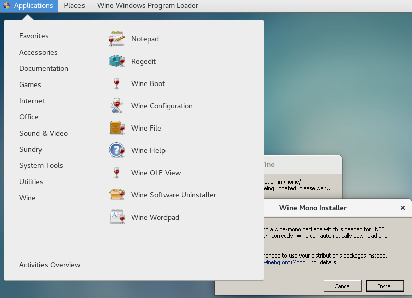
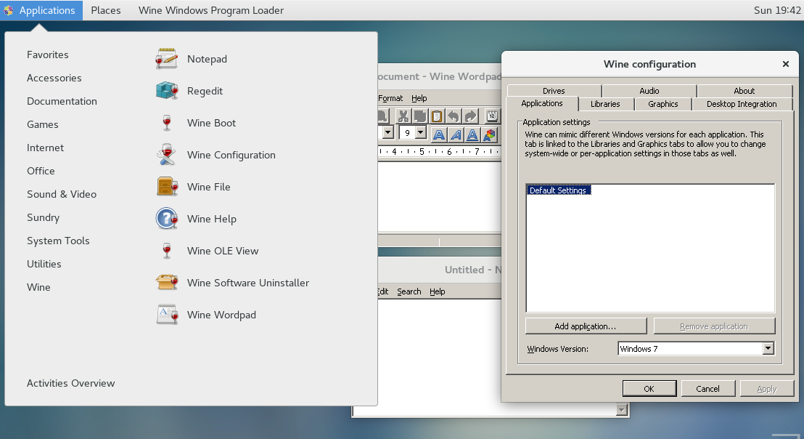
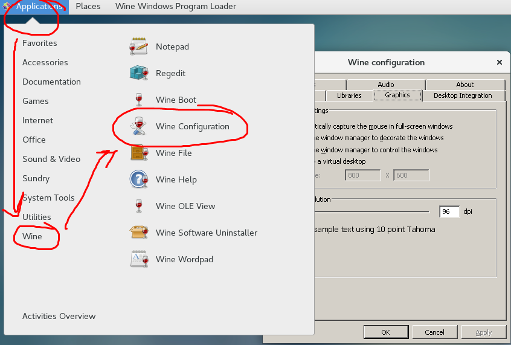
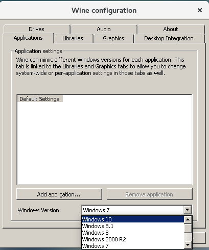
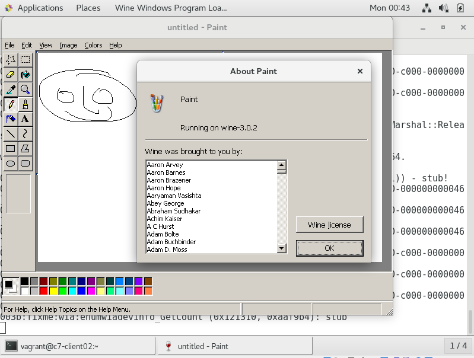
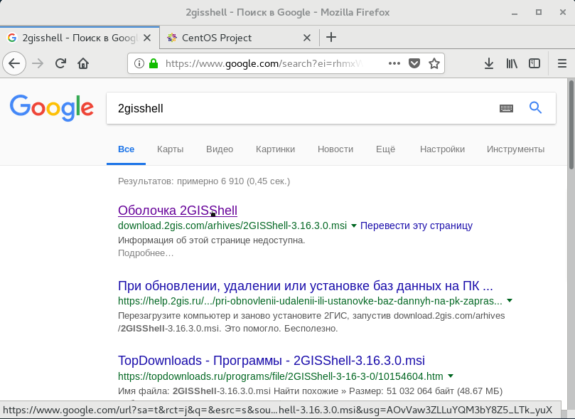
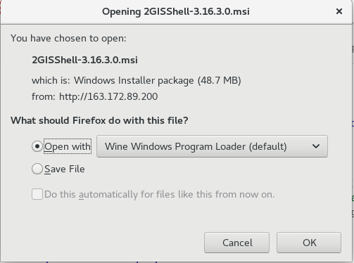
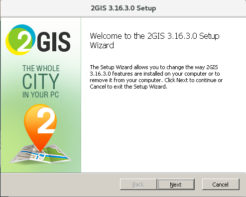
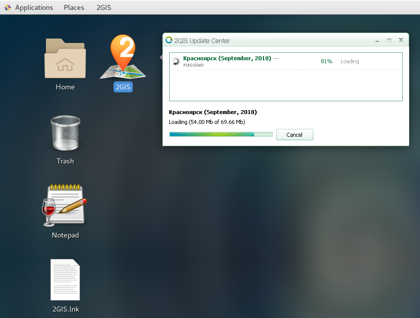

# WINE: среда для запуска классических Windows приложений на GNU/Linux

Отделу технического сопровождения в компании "РиК" была поставлена задача импортозамещения программного обеспечения на рабочих станциях пользователей. Первым шагом в этой задачи был поставлен отказ от зарубежной Операционной Системы Microsoft Windows. Предлагается рассмотреть возможность переноса пользовательских компьютеров и их рабочей среды на GNU/Linux. Для переноса на GNU/Linux программ, изначально hfpработаюших в Windows предлагается использовать проект Wine. Вам предлагается настроить среду для запуска классических Win32 приложений в GNU/Linux.

 По окончанию данной лабораторной работы вы сможете:

- Установить и настроить Wine на CentOS 7.
- Установить и запустить классическое Win32 приложение в GNU/Linux.
- Решать проблемы, связанные с запуском и правильной работой классических WIN32 API приложений в GNU/Linux.

Оглавление


 Описание тестовой среды
  


 Предположительное время: 30 минут

Виртуальные машины: ipa.example.com cl.example.com

| Логин   | Пароль  |
| ---     | ---     |
| root    | redhat  |
| vagrant | vagrant |

## Упражнение 1: Установка и предварительная настройка Wine
  
В данный момент в компании "РиК" не установлены необходимые пакеты, включающие поддержку wine. Необходимо произвести их установку и предварительную настройку.

1. Установка поддержки репозитория `EPEL` и установка `wine.x86_64`
2. Установка поддержки репозитория `wine32` и `winetricks`. Установка пакетов `wine.i686` `winetricks`
3. Предварительный запуск и преднастройка

### Задача 1: Установка поддержки репозитория `EPEL` и установка `wine.x86_64`

Запустите терминал на хосте виртуализации получите доступ к терминалу машины `cl.example.com`

```bash
λ cd c:\VMs\ipa-lab
λ vagrant ssh cl
λ vagrant ssh c7-client01
Last login: Sun Sep 30 17:39:11 2018
----------------------------------------------------------------
  CentOS 7.5.1804                             built 2018-09-30
----------------------------------------------------------------
[vagrant@c7-client01 ~]$
```

Установим поддержку репозитория EPEL и поставим оттуда пакеты wine

```bash
[vagrant@c7-client01 ~]$ sudo yum -y install epel-release
....
[vagrant@c7-client01 ~]$ sudo yum -y install wine\*
...
```

> Вот и всё! Уже можно проверять запуск приложений!
> Но у нас пока ещё нет поддержки запуска x32 приложений, давайте её добавим.

### Задача 2: Установка поддержки репозиториев `wine32`. Установка пакетов

Установим поддержку репозиториев wine32 и winetricks от hardbottle. Поставим пакеты `wine.i686` `winetricks`.

```bash
[vagrant@c7-client01 ~]$ sudo yum -y install https://harbottle.gitlab.io/wine32/7/i386/wine32-release.rpm
....
```

Поставим пакет `wine.i686`,во время установки загрузится и установится ставится много пакетов i686 архитектуры ввиду требований удовлетворения зависимостей, придётся пару минут подождать.

```bash
[vagrant@c7-client01 ~]$ sudo yum -y install wine.i686
...
```

### Задача 3: Первый запуск wine и преднастройка

Проверим, что wine.i686 работает, запустим программы из стандартного набора.

Зайдите под пользователем `student` c паролем `student` в графическую среду `GNOME 3 Desktop Enviroment`. В gnome-terminal дайте команду `alternatives --display wine`

```bash
[vagrant@c7-client01 ~]$ alternatives --display wine
wine - status is auto.
 link currently points to /usr/bin/wine32
/usr/bin/wine64 - priority 10
 slave wine-preloader: /usr/bin/wine64-preloader
/usr/bin/wine32 - priority 20
 slave wine-preloader: /usr/bin/wine32-preloader
Current `best` version is /usr/bin/wine32.
```

Обратите внимание, что при установленном в системе пакете `wine.i686` именно 32 битная версия будет запускаться по умолчанию по вызове команды `wine`.

Запустите программу wineboot из меню приложений, запустим среду.





В диалоговых окнах c запросом загрузки и установки приложений "Wine Mono Installer" и "Wine Gecko Installer" нажмите `Install`
> Описание пакетов Gecko Mono
> https://wiki.winehq.org/Gecko - Wine реализация "Internet Explorer"
> https://wiki.winehq.org/Mono - Открытый проект по реализации ".Net Fremework"


Теперь вы можете запустить стандартные приложения, идущие в комплекте через раздел меню приложений `Wine`



Мы проверили, что `wine` работает, по крайней мере он может запускать WIN32 приложения, поставляемые вместе с пакетом `wine`.

Запустим программу настройки приложения через меню Applications -> Wine -> Wine Configuration



В этом окне мы можем выполнить базовую настройку приложения.

Установите версию Windows в Windows 10. В закладке Application -> Windows Version ->  Windows 10



## Упражнение 2: Загрузка и установка приложений

Теперь, когда среда запуска поставлена, и проверена  пришло время проверить работу Win32 API приложений на CentOS 7 с установленной средой рабочего стола GNOME 3.

1. Установка приложения из списка предлагаемых скриптом winetricks
2. Загрузка из интернет, установка и запуск стороннего приложения в Wine

### Задача 1: Установка приложения из списка предлагаемых скриптом winetricks


Зайдите под пользователем `student` c паролем `student` в графическую среду `GNOME 3 Desktop Enviroment`. В программе `gnome-terminal` запустите скрипт winetricks

```bash

[vagrant@c7-client01 ~]$ sudo yum -y install epel-release # нет необходимости, если репозиторый EPEL уже добавлен
[vagrant@c7-client01 ~]$ sudo yum -y install https://harbottle.gitlab.io/harbottle-main/7/x86_64/harbottle-main-release.rpm
[vagrant@c7-client01 ~]$ sudo yum -y install winetricks
[vagrant@c7-client01 ~]$ WINEPREFIX=~/.wine32 winetricks -q

```

Поставить `winetrick` можно и по другому

Обновлённый скрипт `winetricks` можно загрузить с оффициального сайта https://github.com/Winetricks/winetricks, файл сделать запускаемым и положить в один из каталогов PATH

Например

```bash
[vagrant@c7-client01 ~]$ echo $PATH
[vagrant@c7-client01 ~]$ mkdir ~/bin
[vagrant@c7-client01 bin]$ cd bin
[vagrant@c7-client01 bin]$ wget https://raw.githubusercontent.com/Winetricks/winetricks/master/src/winetricks
[vagrant@c7-client01 bin]$ chmod +x winetricks
[vagrant@c7-client01 ~]$ cd -
```

Теперь инициализируем среду для запуска Win32 приложений

```bash
[vagrant@c7-client01 ~]$ WINEARCH=win32 WINEPREFIX=~/.wine32 wineboot
```

В диалоговых окнах c запросом загрузки и установки приложений "Wine Mono Installer" и "Wine Gecko Installer" нажмите `Install`
> Описание пакетов Gecko Mono
> https://wiki.winehq.org/Gecko - Wine реализация "Internet Explorer"
> https://wiki.winehq.org/Mono - Открытый проект по реализации ".Net Fremework"


Запустим `winetricks` внутри Win32 среды для запуска приложений `WINEPREFIX=~/.wine32` и выберем установку приложения `mspaint`. Для подавления дополнительных предупреждений используем ключ `-q`.

```bash
[vagrant@c7-client01 ~]$ WINEARCH=win32 WINEPREFIX=~/.wine32 winetricks -q
```

В появившемся окне "Winetricks - choose a wineprrefix"  выберем `Install an Application -> mspaint`

> В окне сбора статистики о запуске приложений примите решение и выберите ответ, будете ли вы отправлять разработчикам данные о запуске ваших приложений.

В окне winetricks с сообщением `Working around wine bug 657 -- Native mspaint.exe from XP reqires mfc42.dll` нажмите `OK`.
В окне `VCRedist Installation` нажмите `Ja`.

> В случае появления сообщения `Cannot find cabextract`
> закройте окно, поставьте пакет cabextract и снова запустите `winetricks`

```bash
[vagrant@c7-client01 ~]$ yum install -y cabextract
```

Закроем окно winetricks и запустим `mspaint`, сделаем для него ярлык на рабочий стол

```bash
[vagrant@c7-client01 ~]$ WINEARCH=win32 WINEPREFIX=~/.wine32 wine mspaint
```



Создадим ярлык для запуска приложения на рабочем столе GNOME 3

```bash
[vagrant@c7-client01 ~]$ cd ~
[vagrant@c7-client01 ~]$ cat <<EOF >Desktop/wine-mspaint.desktop
[Desktop Entry]
Name=MS Paint
Comment=Image Editor
Exec=sh -c "WINEARCH=win32 WINEPREFIX=~/.wine32 wine 'C:\Windows\mspaint.exe'"
Icon=mspaint
Terminal=false
Type=Application
Categories=X-Wine;
X-Desktop-File-Install-Version=0.23
EOF
[vagrant@c7-client01 ~]$ chmod +x Desktop/wine-mspaint.desktop
```

Запустим программу через ярлык на рабочем столе.
Ура! Программа `mspaint` запущена и работает в Wine!

### Задача 2: Загрузка из интернет, установка и запуск Win32 приложения в Wine

Загрузим сторонее Win32 приложение из интернета с помощью браузера Firefox



Запустим его установку в среде Wine





Во время установки приложения установщик создал ярлык для запуска приложения.

Запустим приложение и выберем город.



Теперь можно запускать приложение с ярлыка на рабочем столе.


Приложение работает.

Ура! Мы выполнили все упражнения!
Теперь, по желанию, вы можете загрузить и попробовать поставить какое-либо другое ваше часто используемое приложение! Счастливого пути!